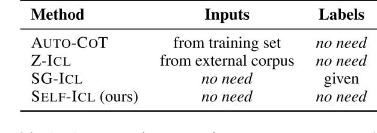
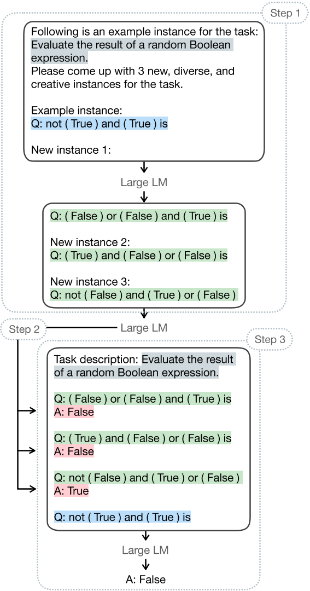
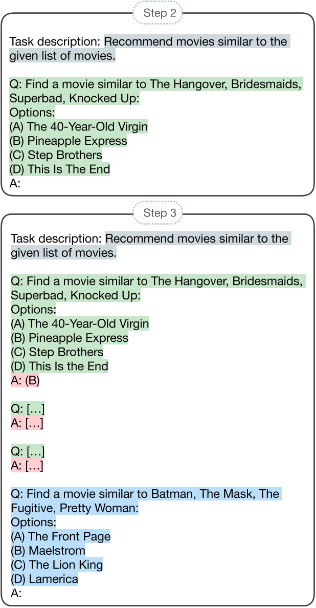
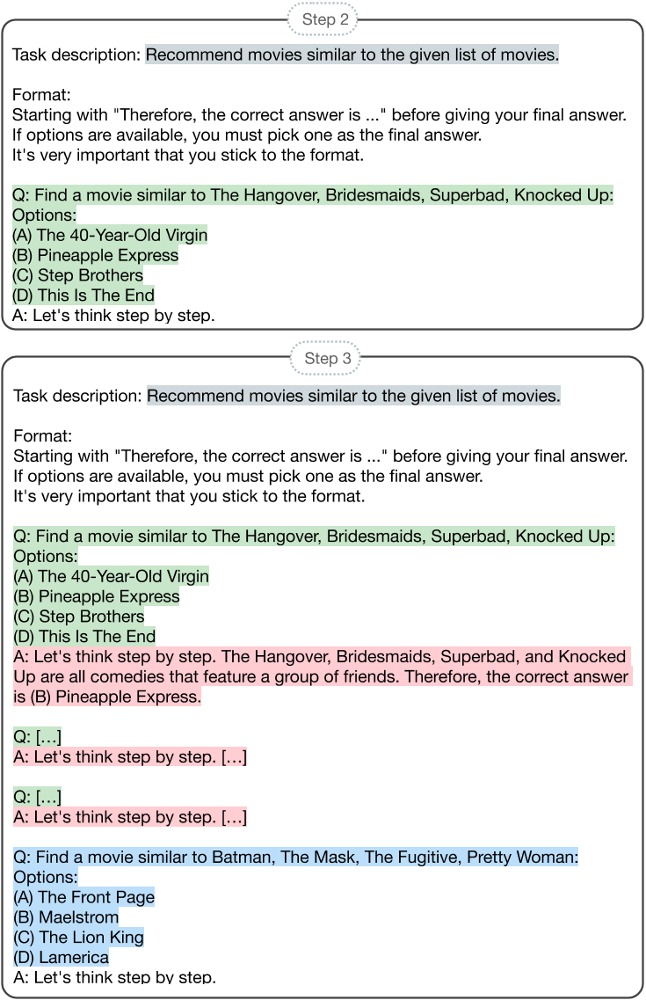
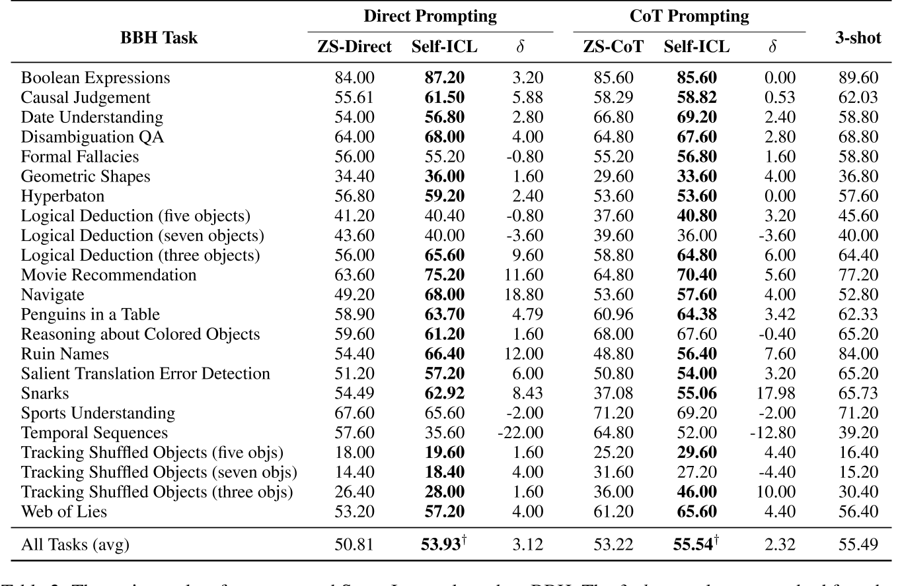
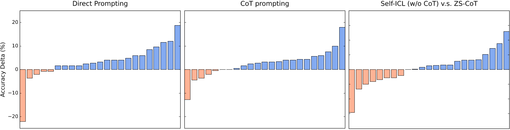
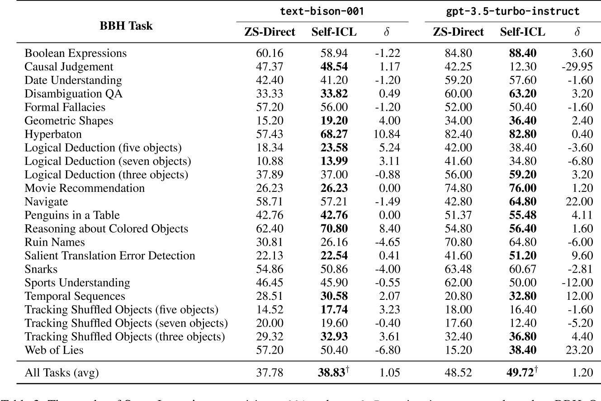

## 摘要

大語言模型(LLM)表現出優秀的語境內學習(ICL, in-context learning)的能力。為提升LLM的ICL能力，許多透過取得現有訓練語料中的有效示範(demonstration, 可以說是context)的方法被提出，但終端使用者在使用LLM時並不能存取訓練語料或demonstration pool。
該文提出一個簡單框架SELF-ICL實現零樣本ICL:

1. 給定一個測試輸入
2. 利用指令引導模型產生多筆偽輸入
3. 令模型預測偽輸入的偽標籤
4. 以偽(輸入/標籤)作為ICL的context預測測試輸入的標籤

於23 BIG-Bench Hard tasks上的測試表明，SELF-ICL優於zero-shot的表現。此外，結合zero-shot CoT(chain-of-thought)，SELF-ICL的表現甚至比肩來自真實語料的示範。

## 簡介

**語境內學習**(ICL, in-context learning), **透過指令給予少量範例**(demonstrations, exemplars)**使LLM適應新任務**(即Few-shot learning)，是使LLM備受關注的的重要特性。**為取得更好的ICL能力**，**選擇具代表性範例的方法**被廣泛研究，**大多方法假設可以存取外部大型資源**(訓練資料集、相關文字語料)並以最鄰近搜尋或其他相似性度量從中選取範例。**然而現實中，使用者**查詢LLM通常透過API或網頁介面，**無權訪問與任務相關的現有語料**。**由使用者自行為任務編寫範例**也增加了使用者的負擔(**費時費力**)。

近期一系列解釋ICL原理的研究被廣泛提出，表明**範例之所以有效不是因其為新任務的學習提供明確引導，而是揭露LLM的隱含能力並引導模型貼近目標領域**，相似現象也出現在CoT(chain-of-thought)和指令增強ICL(instruction-augmented ICL)。表明LLM具有被低估的零樣本能力且具備處理多樣目標任務的能力。

受上述文獻啟發，作者提出**SELF-ICL**，透過**自生成範例**(提供ICL所需輸入與標籤之空間)**引導LLM的隱含能力**。給定一查詢(測試輸入)，SELF-ICL會執行以下步驟:

1. 利用指令引導模型依據給定查詢與相關任務陳述產生多筆偽輸入。
2. 透過零樣本(zero-shot)指令為每筆偽輸入生成偽標籤。
3. 以偽輸入-標籤對做為偽範例與給定查詢合併進行標準ICL。

**所有步驟皆在同一凍結LLM執行，無須從候選池選擇範例，弭平現有技術與終端使用者的實務差距。**

為了於現存範例不易產生的困難任務驗證SELF-ICL的有效性，作者選擇 23 BIG-Bench Hard tasks 作為驗證資料。結果表明**SELF-ICL在所有任務均有顯著提升**(all-task-average accuracy and in head-to-head comparisons)，相較於zero-shot在23個任務中取得 18-0-5 (勝-平-敗) 的成績。且若**結合zero-shot CoT**(chain-of-thought)，SELF-ICL的表現甚至**比肩來自真實語料的示範**。

該文額外驗證SELF-ICL在不同設定下的有效性，如:

* 生成偽輸入的方法
* number of shots
* 隨機偽標籤

據作者所知，該研究**第一個嘗試真zero-shot ICL，無須依賴來自真實分部或預定義標籤集之現有資料。** (如下表)

## SELF-ICL

### 建構偽輸入(step 1)

偽輸入生成可以簡單透過零次指令(zero-shot prompting)達成(如下圖)

給定查詢$q$(取自真實分布)提供實際輸入的輪廓，和相關的任務描述$T$指引模型產生任務領域相關的資訊。模型推理與淺在格式與產稱新的查詢(偽輸入)，在指定中給定$k$(num of shot)，以產生$k$個偽輸入。

### 建構偽標籤(step 2)

取得偽輸入後，利用零次指令在同一LLM預測其偽標籤，使用兩種方法:

* **Direct prompting**

    利用標準零次指令直接產生偽標籤，僅向LLM提供任務描述與需生成偽標籤的偽輸入。一次一對。
    

* **CoT prompting**

    $$觸發短語+推理過程+最終解=偽標籤$$

    利用zero-shot CoT產生偽標籤，向LLM提供任務描述、需生成偽標籤的偽輸入與觸發短語 "Let's think step by step"執行CoT推理。觸發短語置於指令末端引導產生推理過程已得到更準確的最終解。
    

### 預測(step 3)

建構偽範例(偽輸入-標籤對)，以偽範例和指令做為語境，透過Few-shot ICL預測測試輸入的最終答案。

## 實驗設計

### Configurations

* **LM**

    >**InstructGPT**(*text-davinci-003*): **主要測試對象，被社群認為更遵循指令**
    >
    >**text-bison-001**(*PaLM-2*): 次要測試對象，驗證方法是否普遍有效
    >
    >**gpt-3.5-turbo-instruct**(*GPT-3.5, ChatGPT*): 次要測試對象，驗證方法是否普遍有效

* **Implementation details**

    參數設置如下:

    $Temperature = 0$
    $NumOfToken_{max} = 1024$
    $k = 3$

    其他參數沿用官方預設

* **Dataset**

    **BIG-Bench Hard (BBH) benchmark**

    > 共包含了27個任務，其中23個被選為測試任務，皆為單選題，每個任務有150~250的範例，全部共有5,511個。  
    >BBH為BIG-Bench benchmark中的一個任務套組，現有LM在該套組難以到達人類平均水平，被認為難度超越現有模型所擁有的能力。

### Baselines

* **ZS-Direct**
  
    即"zero-shot direct prompting"，direct prompting的Baselines，模型僅依據任務描述和測試輸入預測輸出

* **ZS-CoT**

    即"zero-shot CoT prompting"，CoT prompting的Baselines，zero-shot解複雜推理任務的SOTA(之一，待確認)，模型依任務描述、測試輸入和推理觸發短語"Let's think step by step"預測輸出

## 結果

### 主要表現

> $\delta$ (delta 小寫) 為 SELF-ICL 和 Baseline 的差，正值為高於Baseline，負值為落後於Baseline。  
> $\dagger$ (dagger) 代表通過 [one-sided McNemar's test](https://en.wikipedia.org/wiki/McNemar%27s_test) 確認相對於Baseline的性能增益具顯著性，$p < 0.05$。

1. SELF-ICL 於所有任務的平均表現在Direct和CoT皆超越Baselines。
2. Direct SELF-ICL 微小超越 ZS-CoT。
3. CoT SELF-ICL 能力到達使用真實範例的 3-shot prompting 的水準。

1. **Direct** ZS vs SELF-ICL: | 18勝 | 0平 | 5敗 |
2. **CoT** ZS vs SELF-ICL: | 16勝 | 2平 | 5敗 |
3. **SELF-ICL** Direct vs CoT: | 14勝 | 1平 | 8敗 |

### 普遍性

## 分析

### Preliminary

### The Entanglement of Input Space andInput-Label Mapping

### Different Approaches for Generating Pseudo-Inputs

### Effect of Different Number of Shots

### Effect of Random Pseudo-Labels

### A Deeper Look of SELF-ICL's Pseudo-Inputs

## 相關文獻

### Understanding ICL

### Towards Zero-Shot ICL

## 總結

### 侷限性

* Reliance on instruction-following models
* Better diversify approaches
