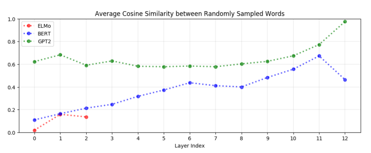
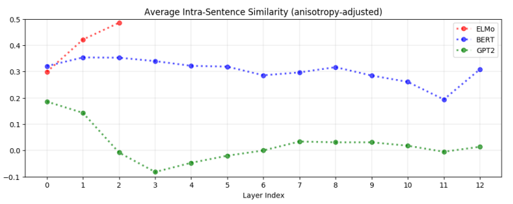
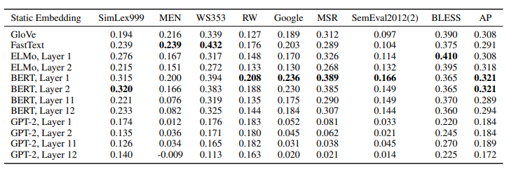

## Abstract

使用語境化詞嵌入替換靜態詞嵌入已在許多NLP任務取得顯著的進步。然而，ELMo和BERT等模型(contextualizing model)所產生的語境化詞嵌入究竟有多語境化?每個詞是否有無限多種特定語境下的表徵或者其本質上是被分配到數量有限的詞表徵中的其中一個?作者發現，在 contextualizing model 的任何一層中，所有詞的語境表徵都不是各向同性的。雖然同一個詞在不同語境下的表徵相較不同詞的表徵具有更大的餘弦相似度，在這種自相似性再上層(輸出)並不明顯。代表 contextualizing model 的上層產生了更多語境表徵，如同LSTM的上層產生更多任務相關的表徵。在ELMo、BERT和GPT-2的所有層中，平均一個詞的語境表徵只有不到5%的方差可以用該詞的靜態嵌入來解釋，為語境表徵的成功提供了一些理由。

## 1 Introduction

深度学习方法在NLP中的应用是通过在低维连续空间中将单词表示为向量而实现的。传统上，这些词的嵌入是静态的：每个词都有一个单一的向量，与上下文无关（Mikolov等人，2013a；Pennington等人，2014）。这带来了几个问题，最明显的是，一个多义词的所有意义都必须共享相同的表示。最近的工作，即深度神经语言模型，如ELMo（Peters等人，2018）和BERT（Devlin等人，2018）、我们成功地创建了上下文关联的单词表示，即对其出现的上下文敏感的单词向量。用上下文表征取代静态嵌入，在一系列不同的NLP任务中产生了显著的改进，从回答问题到核心推理。

语境化词汇表征的成功表明，尽管只用语言建模任务进行训练，但它们可以学习到高度可转移的、与任务无关的语言属性。事实上，在冻结的语境化表征上训练的线性探测模型可以预测单词的语言属性（例如，语篇标签），几乎与最先进的模型一样好（Liu等人，2019a；Hewitt和Manning，2019）。但是，这些表征仍然没有得到很好的理解。 首先，这些语境化的词汇表征到底有多大的语境性？BERT和ELMo是否有无限多的特定语境表征可以分配给每个单词，或者单词基本上是在有限数量的词义表征中分配一个？

我们通过研究ELMo、BERT和GPT-2的每一层的表示空间的几何形状来回答这个问题。我们的分析产生了一些令人惊讶的发现：

1. 在所有三个模型的所有层中，所有单词的上下文表征都不是各向同性的：它们在方向上不是均匀分布的。相反，它们是各向异性的，在矢量空间中占据一个狭窄的锥体。GPT-2的最后一层的各向异性是如此的极端，以至于两个随机的词平均来说会有几乎完美的余弦相似性鉴于各向异性对静态嵌入有理论和经验上的好处（Mu等人，2018），上下文代表中各向异性的程度令人惊讶。
2. 同一个词在不同语境中的出现具有非相同的向量表示。在矢量相似性被定义为余弦相似性的情况下，这些表征在上层中彼此更加不相似。这表明，就像LSTM的上层产生更多特定任务的表征一样（Liu等人，2019a），上下文模型的上层产生更多的特定语境表征。
3. 语境特定性在ELMo、BERT和GPT-2中表现得非常不同。在ELMo中，同一句子中的词的表征随着上层的语境特异性的增加而变得更加相似；在BERT中，它们在上层变得更加不相似，但仍然比随机抽样的词平均更加相似；然而在GPT-2中，同一句子中的词并不比两个随机选择的词更加相似。
4. 在对各向异性的影响进行调整后，平均而言，一个词的上下文表征中只有不到5%的方差可以由其第一主成分来解释。 这表明，上下文表征并不对应于有限数量的词义表征，即使在最好的情况下，静态嵌入也是上下文表征的糟糕替代。不过，通过提取一个词的上下文表征的第一个主成分而创建的静态嵌入在许多词向量基准上的表现优于GloVe和FastText嵌入。

这些见解有助于证明为什么使用上下文表征能使许多NLP任务得到如此显著的改善。

## 2 Related Work

### 2.1 Static Word Embeddings

Skip-gram with negative sampling（SGNS）（Mikolov等人，2013a）和GloVe（Pennington等人，2014）是生成静态词嵌入的最著名的模型之一。尽管它们在实践中迭代地学习嵌入，但已经证明在理论上它们都隐含了一个包含共现统计的词-语境矩阵的因子（Levy和Goldberg，2014a，b）。由于它们为每个词创建了一个单一的表示，静态词嵌入的一个显著问题是，一个多义词的所有意义必须共享一个矢量。

### 2.2 Contextualized Word Representations

鉴于静态单词嵌入的局限性，最近的工作试图创建对语境敏感的单词表示。ELMo（Peters等人，2018）、BERT（Devlin等人，2018）和GPT-2（Radford等人，2019）是深度神经语言模型，它们经过微调，为广泛的下游NLP任务创建模型。他们对单词的内部表征被称为语境化的单词表征，因为它们是整个输入句子的一个函数。这种方法的成功表明，这些表征捕捉到了语言的高度可转移性和任务无关的属性（Liu等人，2019a）

ELMo通过串联在双向语言建模任务上训练的2层biLSTM的内部状态来创建每个标记的语境化表示（Peters等人，2018）。相比之下，BERT和GPT-2分别是双向和单向的基于转化器的语言模型。12层的BERT（基础，套管）和12层的GPT-2的每个转化器层通过关注输入句子的不同部分来创建每个标记的语境化表示（Devlin等人，2018；Radford等人，2019）。BERT--以及BERT的后续迭代（Liu等人，2019b；Yang等人，2019）--在各种下游NLP任务上取得了最先进的性能，包括从问题回答到情感分析。

### 2.3 Probing Tasks

之前对语境化词汇表征的分析主要限于探测任务（Tenney等人，2019；Hewitt和Manning，2019）。这涉及到训练线性模型来预测单词的句法（如语篇标签）和语义（如单词关系）属性。探测模型的前提是，如果一个简单的线性模型可以被训练来准确预测语言属性，那么表征就会隐含地开始编码这一信息。虽然这些分析发现，语境化的表征编码了语义和句法信息，但它们无法回答这些表征的语境性如何，以及它们在多大程度上可以被静态词缀取代，如果有的话。因此，我们在本文中的工作与大多数对语境化表征的剖析明显不同。它更类似于Mimno和Thompson（2017），后者研究了静态词嵌入空间的几何学。

## 3 Approach

### 3.1 Contextualizing Models

我们在本文中研究的语境化模型是ELMo、BERT和GPT-21。我们选择BERT的基础案例版本，因为它在层数和维度方面与GPT-2最具可比性。我们所使用的模型都是在各自的语言建模任务中预先训练过的。尽管ELMo、BERT和GPT-2分别有2、12和12个隐藏层，但我们也将每个语境化模型的输入层作为其第0层。这是因为第0层没有进行上下文处理，使其成为比较后续层所做的上下文处理的有用基线。

### 3.2 Data

为了分析语境化的单词表征，我们需要输入的句子来输入我们的预训练模型。我们的输入数据来自2012-2016年的SemEval语义文本相似性任务（Agirre等人，2012，2013，2014，2015）。我们使用这些数据集是因为它们包含了相同的词出现在不同语境中的句子。例如，"狗 "这个词出现在 "一只熊猫狗在路上跑 "和 "一只狗想把培根从背上拿下来 "中。 如果一个模型在这两个句子中为 "狗 "生成了相同的表示，我们可以推断出没有上下文；相反，如果这两个表示不同，我们可以推断出它们在某种程度上被上下文化。利用这些数据集，我们将单词映射到它们出现的句子列表以及它们在这些句子中的索引。在我们的分析中，我们不考虑那些出现在少于5个独特语境中的词。

### 3.3 Measures of Contextuality

我们用三个不同的指标来衡量一个词的上下文表述的程度：自相似性、句内相似性和最大可解释方差。

**Definition 1** 让 $w$ 是一个分别出现在句子 ${s_1,...,s_n}$ 的索引 ${i_1,...,i_n}$ 的词，这样 $w=s_1[i_1]=...=s_n[i_n]$ 。让 $f_\ell (s,i)$ 成为一个函数，将 $s[i]$ 映射到模型 $f$ 的第 $\ell$ 层中的表示。 $w$ 在第 $\ell$ 层中的自相似性为

$$SelfSim_\ell (w) = \frac{1}{n^2-n} \sum_{j} \sum_{k \not = j} \cos (f\ell(s_j, i_j), f\ell(s_k, i_k))$$

其中 cos 表示余弦相似度。换句话说，一个单词 $w$ 在第 $\ell$ 层中的自相似性是其在 $n$ 个独特语境中的上下文表征之间的平均余弦相似度。 如果第 $\ell$ 层完全不对表征进行上下文化，那么 $SelfSim_\ell(w)=1$ （即表征在所有语境中都是相同的）。对于 $w$ 来说，表征的情境化程度越高，我们期望它的自我相似性就越低。

> $SelfSim$計算同一個詞在不同句子(語境)中嵌入向量(表徵)的相似度，設有$A、B、C$三個不同的句子，且三個句子中皆有詞$W$，取得$W$在所有句子的嵌入$W_A、W_B、W_C$，並倆兩計算他們之間的餘弦相似度$Sim_{AB}、Sim_{AC}、Sim_{BA}、Sim_{BC}、Sim_{CA}、Sim_{CB}$並計算平均。表徵的語境化程度越高，$SelfSim$就越低(代表不同語境的表徵十分不同)

**Definition 2** 让 $s$ 是一个句子，是 $n$ 个词的序列 $\langle w_{1},...,w_{ni}\rangle$ 。让 $f_\ell (s,i)$ 是一个函数，将 $s[i]$ 映射到模型 $f$ 的第 $\ell$ 层中的表示。 $s$ 在第 $\ell$ 层中的句子内部相似度为

$$IntraSim_\ell (s) = \frac{1}{n} \sum_{i} \cos(\vec{s_\ell}, f_\ell(s, i))$$
$$\text{where} \ \vec{s_\ell} = \frac{1}{n} \sum_i f_{\ell}(s, i)$$

更简单地说，**一个句子的句内相似性是其单词表征和句子向量之间的平均余弦相似度**，而句子向量只是这些单词向量的平均值。这种测量方法捕捉到了语境的特殊性在向量空间中的表现。这个衡量标准抓住了上下文特定性在向量空间中的表现。例如，**如果 $IntraSim_\ell(s)$ 和 $SelfSim_\ell(w)$ 都是低的 $∀ w∈s$**(趨異)，那么模型通过给每个词一个上下文特定的表示，使该层中的词与句子中所有其他词的表示不同，从而实现上下文的关联。**如果 $IntraSim_\ell(s)$ 是高的**(趨同)，但 $SelfSim_\ell(w)$ 是低的，这表明上下文的细微差别较小，句子中的词只是通过使它们的表征在向量空间中趋同而被上下文化。

> $IntraSim$計算句中每個詞的嵌入向量和句嵌入向量(使用句中所有詞嵌入之平均)的平均相似性。
> | \ | $IntraSim \ Low$  | $IntraSim \ Hight$ |
> | :-- | :--: | :--: |
> | $SelfSim \ Low$   | 模型在不同語境下給予每個詞一個獨特的表徵，從而實現語境化嵌入 | 模型透過同化句子中詞的嵌入表徵來實現語境化嵌入 |
> | $SelfSim \ Hight$ | 模型給予每個詞一個讀特的表徵，在所有語境中皆使用同一表徵，與傳統靜態嵌入無異 | 極為糟糕，模型給予每個詞幾乎相同的表徵 |

**Definition 3** 让 $w$ 是一个分别出现在句子 ${s_1,...,s_n}$ 的索引 ${i_1,...,i_n}$ 的词，这样 $w = s_1[i_1] = ... = s_n[i_n]$ 。让 $f\ell(s,i)$ 成为一个函数，将 $s[i]$ 映射到模型f的第 $\ell$ 层中的表示。其中 $[ f\ell(s1,i1)...f\ell(sn,in)]$ 是 $w$ 的发生矩阵， $σ_1...σ_m$ 是该矩阵的前 $m$ 个奇异值，最大可解释方差为

$$MEV_{\ell}(w)=\frac{\sigma^2_1}{\sum_i \sigma_1^2}$$

$MEV_\ell(w)$ 是指在某一层的 $w$ 的上下文表征中，可由其第一主成分解释的方差比例。它为我们提供了一个关于静态嵌入可以取代一个词的上下文表征的上限。 $MEV_\ell(w)$ 越接近于 $0$，静态嵌入的替代性就越差；如果 $MEV_\ell(w)=1$ ，那么静态嵌入将是上下文表征的完美替代。

> MEV代表同一個詞在不同語境中的表徵所形成的分布，每一個主成分可以當成一個軸，如果第一主成分(最大的那個)，可以表達越多資訊(MEV越大)，代表同一個詞在不同語境的表徵會聚集到空間中的一個軸附近(容易使用一個固定的表徵替代)，反之MEV越小，代表同一個詞在不同語境的表徵會均於分散於空間中。

### 3.4 Adjusting for Anisotropy

在讨论语境性时，考虑各向同性（或缺乏各向同性）是很重要的。例如，如果单词向量是**完全各向同性**的（即方向一致，**任意兩個詞的相似度低**），那么 $SelfSim_\ell (w)=0.95$ 将表明 $w$ 的表征的语境性很差。然而，考虑到这样的情况，即词向量是如此的各向异性，任何两个词的平均余弦相似度为$0.99$。那么 $SelfSim_\ell (w)=0.95$ 实际上就表明了相反的情况--$w$的表征被很好地上下文化了。这是因为$w$在不同语境中的表征平均来说比两个随机选择的词更不相似。

为了**调整各向异性的影响**，我们使用了三种各向异性的基线，每一种用于我们的语境性测量。对于自相似性和句子内相似性，基线是来自不同语境的均匀随机抽样的词的表征之间的平均余弦相似度。在一个给定的层中，单词表征的各向异性越大，这个基线就越接近于1。对于最大可解释方差（MEV），基线是均匀随机抽样的单词表征中被其第一主成分解释的方差比例。某一层的表征越是各向异性，这个基线就越接近于1：即使是随机抽样的词，主成分也能解释很大一部分的方差

由于情境性测量是针对情境化模型的每一层计算的，我们也为每一层计算单独的基线。然后，我们从每个测量值中减去其各自的基线，得到各向异性调整后的背景性测量。例如，各向异性调整后的自相似性为

$$Baseline(f_\ell) = E_{x,y∼U(O)}[\cos(f_\ell(x), f_\ell(y))]$$
$$SelfSim^∗_\ell(w) = SelfSim_\ell(w)−Baseline(f_\ell)$$

其中$O$是所有单词出现的集合，$f_\ell()$将一个单词出现映射到模型$f$的$\ell$层中的表示。除非另有说明，本文其余部分中提到的语境性测量是指各向异性调整后的测量，其中原始测量和基线都是用1K个均匀的随机抽样的词表征来估计的。

> baseLine of $SelfSim、IntraSim$: 隨機抽兩個詞的表徵間的平均餘弦相似度(1K組)，與各向異性程度成正比  
> baseLine of $MEV$: 隨機抽取1K個詞的表徵，並計算其構成的矩陣之$MEV$，與各向異性程度成正比

## 4 Findings

图1：在BERT、ELMo和GPT-2的几乎所有层中，单词表征都是各向异性的（每個方向的分布並非都是均勻分布）：统一随机采样的单词之间的平均余弦相似度不为零。 唯一的例外是ELMo的输入层；鉴于它生成字符级嵌入而不使用上下文，这并不令人惊讶。高层的表征通常比低层的表征更加各向异性。

### 4.1 (An)Isotropy

**上下文的表征在所有非输入层都是各向异性的。** 如果来自某一层的单词表征是各向同性的（每個方向的分布都是均勻分布），那么均匀随机采样的单词之间的平均余弦相似度将是0（Arora等人，2017）。这个平均值越接近于1，表示各向异性越大。各向异性的几何解释是，词的表征都在向量空间中占据一个狭窄的锥体，而不是在所有方向上都是均匀的；各向异性越大，这个圆锥就越窄（Mimno和Thompson，2017）。如图1所示，这意味着**在BERT、ELMo和GPT-2的几乎所有层中，所有单词的表征都在向量空间中占据一个狭窄的圆锥**。唯一的例外是ELMo的输入层，它产生静态的字符级嵌入，而不使用上下文甚至位置信息（Peters等人，2018）。然而，应该注意的是，**并非所有的静态嵌入都一定是各向同性的**；Mimno和Thompson（2017）发现，**同样是静态的skipgram嵌入并不是各向同性的**。

> 那靜態的skipgram嵌入各向異性的程度為何?各向異性程度與餘弦相似度的準確性是否明確成反比?

**语境化的表征一般在较高的层次上更具有各向异性。** 如图1所示，对于GPT-2，均匀随机的单词之间的平均余弦相似度在第2层到第8层大致为0.6，但从第8层到第12层呈指数级增长。事实上，GPT-2的最后一层的单词表示是如此的各向异性，以至于任何两个单词的平均余弦相似度几乎是完美的!这种模式也适用于BERT和ELMo，但也有例外：例如，BERT的倒数第二层的各向异性比最后一层高得多。

**各向同性对静态词嵌入有理论和经验上的好处**。在理论上，**它允许在训练期间进行更强的 "自我规范化"**（Arora等人，2017），并且**在实践中，从静态嵌入中减去平均矢量会导致在几个下游NLP任务上的改**进（Mu等人，2018）。因此，在语境化词汇表征中看到的极端程度的各向异性--特别是在较高的层中--是令人惊讶的。如图1所示，对于所有三个模型，**上下文隐蔽层的表征几乎都比输入层的表征更加各向异性**，后者没有纳入上下文。**这表明高各向异性是语境化过程所固有的，或者至少是语境化过程的副产品。**

图2：同一个词在不同语境中的平均余弦相似度被称为该词的自相似度（见定义1）。上面，我们绘制了各向异性调整后的均匀随机抽样词的平均自相似度（见3.4节）。在所有三个模型中，层数越高，自相似度越低，这表明在较高的层数中，语境化的词汇表征更具有语境针对性。

图3：句内相似度是指一个句子中每个词的表现形式与它们的平均值之间的平均余弦相似度（见定义2）。上面，我们绘制了均匀随机抽样的句子的平均句内相似度，并对各向异性进行了调整。这个统计数字反映了上下文特定性在表示空间中的表现，如上所述，它在ELMo、BERT和GPT-2中的表现非常不同。

### 4.2 Context-Specificity

**语境化的词汇表征在更高的层次上更具有语境针对性。** 从定义1中可以看出，一个词的自相似性，在一个给定模型的某一层中，是它在不同语境中的表征的平均余弦相似度，并根据各向异性进行调整。如果自相似性为1，那么这些表征就完全没有语境特异性；如果自相似性为0，那么这些表征就具有最大的语境特异性。在图2中，我们绘制了BERT、ELMo和GPT-2各层中均匀随机抽样的词的平均自相似度。例如，ELMo的输入层的自相似度是1.0，因为该层的表征是静态字符级嵌入。

在所有三个模型中，层数越高，自我相似度平均越低。换句话说，层数越高，上下文表征的具体内容越多。这一发现具有直观的意义。在图像分类模型中，低层识别更多的通用特征，如边缘，而高层识别更多的特定类别特征（Yosinski等人，2014）。同样，在NLP任务上训练的LSTM的上层会学习更多的特定任务表征（Liu等人，2019a）。因此，由此可见，神经语言模型的上层会学习更多的特定语境表征，从而更准确地预测特定语境下的下一个单词。在所有三个模型中，GPT-2的表征是最有语境针对性的，GPT-2最后一层的表征几乎是最大的语境针对性。

**停顿词（例如，"the"、"of"、"to"）是最有语境针对性的表述之一。** 在所有的层中，停顿词的自我相似度是所有词中最低的，这意味着它们的上下文表征是最有背景的。例如，在ELMo的各层中，平均自我相似度最低的词是 "and"、"of"、"s"、"the "和 "to"。鉴于这些词不是多义词，这相对来说是令人惊讶的。这一发现表明，一个词所出现的各种语境，而不是其固有的多义性，是推动其语境化表征变化的原因。这回答了我们在介绍中提出的一个问题：ELMo、BERT和GPT-2并不是简单地将有限数量的词义表征中的一个分配给每个词；否则，在具有如此少的词义的词的表征中就不会有如此多的变化。

**上下文的特定性在ELMo、BERT和GPT-2中表现得非常不同。** 如前所述，在ELMo、BERT和GPT2的上层，情境化的表征更具情境特异性。然而，这种增加的语境特异性在向量空间中是如何体现的？同一句子中的单词表征是否会收敛到一个点上，或者它们在与其他语境中的表征不同的同时，仍然保持着彼此的不同？为了回答这个问题，我们可以测量一个句子的句内相似度。从定义2中可以看出，在给定模型的某一层中，一个句子的句内相似性是其每个词表征与它们的平均值之间的平均余弦相似度，并根据各向异性进行调整。在图3中，我们绘制了500个均匀随机抽样的句子的平均句内相似度。

**在ELMo中，同一句子中的单词在上层的相似度更高。** 随着一个句子中的单词表征在上层变得更加具有语境针对性，句子内的相似度也会上升。这表明，在实践中，ELMo最终将Firth（1957）的分布假说背后的直觉延伸到了句子层面：因为同一句子中的词有相同的语境，它们的语境化表示也应该是相似的。

**在BERT中，同一句子中的单词在上层的相异性更大。** 随着一个句子中的单词表征在上层变得更有语境针对性，它们会彼此渐行渐远，尽管也有例外（见图3中第12层）。然而，在所有层中，同一句子中的单词之间的平均相似度仍然大于随机选择的单词之间的平均相似度（即各向异性基线）。这表明，与ELMo相比，BERT有一个更细微的上下文，它认识到，虽然周围的句子告知了一个词的含义，但同一句子中的两个词不一定有相似的含义，因为它们有相同的背景。

**在GPT-2中，同一句子中的单词表征与随机抽样的单词相比，彼此之间的相似度不高。** 平均而言，未经调整的句内相似度与各向异性基线大致相同，因此从图3中可以看出，各向异性调整后的句内相似度在GPT-2的大多数层中接近于0。事实上，句内相似度在输入层中是最高的，该层完全不对词进行上下文处理。这与ELMo和BERT形成鲜明对比，在这两个机构中，除了一个层之外，其他层的平均句内相似度都高于0.20。

正如前面讨论BERT时指出的，这种行为仍然具有直观的意义：同一个句子中的两个词不一定有相似的意义，仅仅是因为它们有相同的上下文。GPT-2的成功表明，与各向异性不同的是，在所有三个模型中，各向异性都伴随着语境特异性，句子内的高相似性并不是语境化所固有的。同一句子中的词可以有高度的语境化表征，而这些表征并不比两个随机的词表征更相似。然而，目前还不清楚这些句子内相似性的差异是否可以追溯到模型结构的差异；我们把这个问题留给未来的工作。

图4：一个词的最大可解释方差（MEV）是其上下文表征中可由其第一主成分解释的方差比例（见定义3）。上面，我们绘制了各向异性调整后的均匀随机抽样词的平均MEV。在任何模型的任何一层中，静态嵌入都不能解释一个词的上下文表征中超过5%的方差。

表1：各种静态嵌入在单词嵌入基准任务中的表现。每项任务的最佳结果用粗体表示。对于上下文模型（ELMo，BERT，GPT-2），我们使用一个词在某一层的上下文表征的第一主成分作为其静态嵌入。使用ELMo和BERT的语境化表征创建的静态嵌入往往比GloVe和FastText向量的表现更好。

### 4.3 Static vs. Contextualized

**平均来说，一个词的上下文表征中只有不到5%的方差可以由静态嵌入来解释。** 从定义3中可以看出，对于给定模型的某一层，一个词的最大可解释方差（MEV）是其上下文表征中可由其第一主成分解释的方差比例。这为我们提供了一个关于静态嵌入能多好地取代一个词的上下文表征的上限。因为上下文表征是各向异性的（见第4.1节），所有词的大部分变化都可以由一个单一的向量来解释。我们通过计算统一随机抽样的单词表征的第一主成分所解释的方差比例，并从原始MEV中减去这一比例来调整各向异性。在图4中，我们绘制了各向异性调整后的平均MEV，横跨均匀随机抽样的词。

在ELMo、BERT或GPT-2的任何一层中，平均来说，一个词的上下文表征中的方差都不能被静态嵌入所解释，而超过5%。虽然在图4中看不到，但许多词的原始MEV实际上低于各向异性基线：也就是说，所有词的方差中更大的比例可以由一个单一的向量来解释，而不是一个词的所有表征的方差。请注意，5%的阈值代表了最好的情况，理论上不能保证使用GloVe获得的词向量，例如，与最大限度提高MEV的静态嵌入相似。这表明，语境化模型并不是简单地将有限数量的词义表征中的一个分配给每个词--否则，解释的方差比例会高得多。即使是ELMo和BERT的所有层的平均原始MEV也低于5%；只有GPT-2的原始MEV是不可忽略的，由于极高的各向异性，第2至11层的原始MEV平均为30%左右。

**在许多基准上，低层的上下文表征的主成分超过了GloVe和FastText。** 如前所述，我们可以通过在给定层中提取其上下文表征的第一个主成分（PC）来为每个词创建静态嵌入。在表1中，我们绘制了这些PC静态嵌入在几个基准任务中的表现2。这些任务包括语义相似性、类比解决和概念分类：SimLex999（Hill等人，2015）、MEN（Bruni等人，2014）、WS353（Finkelstein等人，2002）、RW（Luong等人，2013）、SemEval-2012（Jurgens等人，2012）、Google类比解决（Mikolov等人，2013a）MSR类比解决（Mikolov等人，2013b）、BLESS（Baroni和Lenci，2011）以及AP（Almuhareb和Poesio，2004）。我们在表1中不考虑第3-10层，因为它们的性能介于第2和11层之间。

表现最好的PC静态嵌入属于BERT的第一层，尽管BERT和ELMo的其他层的PC静态嵌入在大多数基准上也优于GloVe和FastText。对于所有三个上下文模型，从低层创建的PC静态嵌入比从高层创建的更有效。使用GPT-2创建的静态嵌入也明显比来自ELMo和BERT的静态嵌入表现差。鉴于上层比下层更具有语境特异性，而且GPT2的表征比ELMo和BERT的更具有语境特异性（见图2），这表明高度语境特异性表征的PC在传统基准上的效果较差。那些从较少的上下文特定表征中得出的表征，如来自BERT第1层的表征，要有效得多。

## 5 Future Work

我们的发现为未来的工作提供了一些新的方向。首先，正如本文前面所指出的，Mu等人（2018）发现，使静态嵌入更加各向同性--通过从每个嵌入中减去其平均值--导致下游任务的性能有惊人的改善。 鉴于各向同性对静态嵌入有好处，它可能对上下文词表征也有好处，尽管后者已经产生了重大改善，尽管是高度各向异性。因此，在语言建模的目标中加入各向异性的惩罚--鼓励上下文表征更加各向同性--可能会产生更好的结果。

未来工作的另一个方向是从语境化的词生成静态的词表示。虽然后者提供了卓越的性能，但在生产中部署大型模型，如BERT，往往存在内存和运行时间方面的挑战。我们在第4.3节中的工作表明，不仅有可能从上下文模型中提取静态表示，而且这些提取的向量与传统的静态嵌入（如GloVe和FastText）相比，在一系列不同的任务中通常表现得更好。这可能是一种从语境化模型中提取一些用途的手段，而不需要承担在生产中使用它们的全部成本。

## 6 Conclusion

在本文中，我们调查了上下文语境下的单词表征到底是怎样的。其一，我们发现ELMo、BERT和GPT-2的上层比下层产生更多的上下文特定表征。这种语境特异性的增加总是伴随着各向异性的增加。然而，语境特异性在三个模型中的表现也不同；各向异性调整后的同一句子中单词之间的相似性在ELMo中最高，但在GPT-2中几乎不存在。我们最终发现，在对各向异性进行调整后，平均来说，一个词的上下文表征中只有不到5%的方差可以用静态嵌入来解释。这意味着，即使在最好的情况下，在所有模型的所有层中，静态的单词嵌入也不能很好地替代上下文的嵌入。这些见解有助于解释上下文表征在一系列不同的NLP任务中所取得的显著成功。
