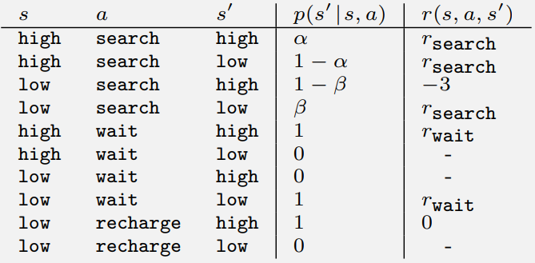
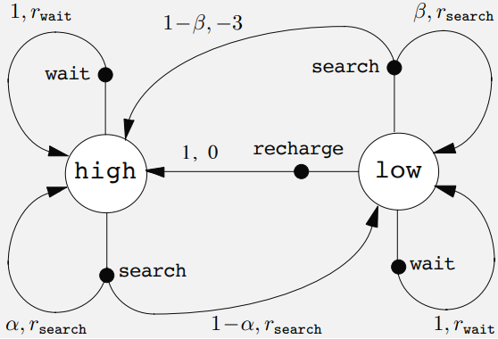
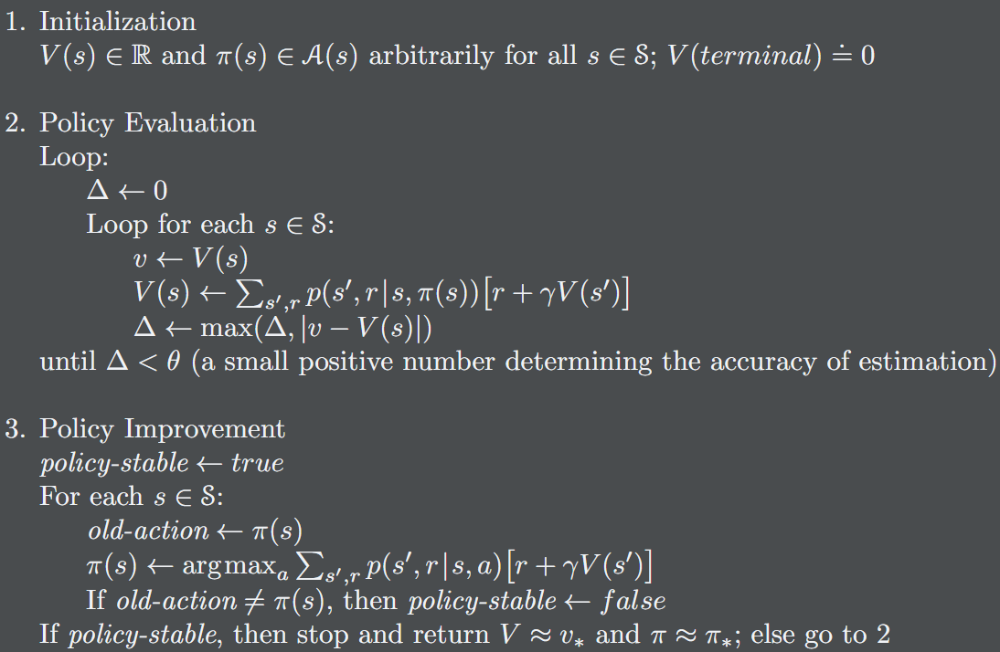

## 馬可夫決策過程

強化學習(Reinforcement Learning, RL)藉由互動學習如何行動以實現目標，而馬可夫決策過程(Markov decision processes, MDPs)，是RL數學化的一種理想表示。MDPs中，代理(agent)與其環境(environment)在一連串分立的時步互動，其中代理是完全可知且可控的，而環境是不完全可控且很有可能難以理解的。代理與環境之互動遵循以下定義:

1. 代理選擇動作(action)
2. 動作的選擇基於狀態(states)
3. 選擇的驗證基於回饋(rewards)

策略(policy)定義代理在給定狀態$S_t$下如何選擇動作$A_t$，而代理的目標為最大化期望回饋$G_t$。

$$G_t = R_{t+1}+R_{t+2}+R_{t+3}+\dotsb+R_T$$
$T$為最終時步，該形式如果再$T$極大時令$G_t$發散至無窮，所以實務上會使用以下形式:

$$
G_t = R_{t+1}+\gamma R_{t+2}+\gamma^2 R_{t+3}+\dotsb=\sum_{k=0}^{\infty}\gamma^kR_{t+k+1}, \text{ in }
0 \le \gamma \le 1
$$

$\gamma$為衰減係數。上式以遞迴形式表達:

$$
\begin{align*}
G_t &= R_{t+1}+\gamma R_{t+2}+\gamma^2 R_{t+3}+\dotsb \\\
&= R_{t+1}+\gamma (R_{t+2}+\gamma R_{t+3}+\dotsb) \\\
&= R_{t+1}+\gamma G_{t+1}
\end{align*}
$$

範例:
$$
\begin{align*}
\mathcal{S} &= \set{ \text{high}, \text{low} } \\\
\mathcal{R} &= \set{ -3, 0, r_{\text{wait}}, r_{\text{search}} } \\\
\mathcal{A(\text{hight})} &= \set{ \text{search}, \text{wait} } \\\
\mathcal{A(\text{low})} &= \set{ \text{search}, \text{wait}, \text{recharge} } \\\
\end{align*}
$$

MDPs以表表示:

以轉移機率圖表示:

### 策略與價值函數

大部分的強化學習演算法需要***價值函數***，其估計代理在給定的狀態(或狀態-操作對)在未來的期望回饋總和，與策略有關。

***策略***將狀態$S$映射為每個可能操作的機率，如果代理在時間$t$遵循策略$\pi$，則$\pi(a|s)$即為在狀態$S_t=s$下操作為$A_t=a$機率。

策略$\pi$的*狀態-價值函數* :

$$
\begin{align*}
v_{\pi}(s) &= \mathbb{E}\_{\pi} [G_t|S_t=s] \\\
&= \mathbb{E}\_{\pi} [\sum_{k=0}^{\infty}\gamma^kR_{t+k+1}|S_t=s]  \\\
&= \sum_a \pi(a|s) \sum_{s^\prime, r} p[s^\prime, r|s, a](r+\gamma v_\pi(s^\prime)), \text{~for all } s \in \mathcal{S}
\end{align*}
$$

策略$\pi$的*動作-價值函數* :

$$
\begin{align*}
q_{\pi}(s, a) &= \mathbb{E}\_{\pi}[G_t|S_t=s, A_t=a] \\\
&= \mathbb{E}\_{\pi}[\sum_{k=0}^{\infty}\gamma^kR_{t+k+1}|S_t=s, A_t=a] \\\
&= \mathbb{E}[R_{t+1}+\gamma v_\pi(S_{t+1})] \\\
&= \sum_{s^\prime, r} p[s^\prime, r|s, a](r+\gamma v_\pi(s^\prime))
\end{align*}
$$

### 最佳化策略和最佳化價值函數

解RL任務即為找一可以在長久運行下取得大量回饋的策略。如$\pi \ge \pi^\prime$，則$v_\pi(s) \ge v_{\pi^\prime}(s),~ s \in \mathcal{S}$必成立。最佳策略用$\pi^*$表示，其對應狀態-價值函數與動作-價值函數為:

$$v_*(s)= \max_\pi v_\pi(s),~ s \in \mathcal{S}$$

$$
\begin{align*}
q_\*(s, a) &= \max_\pi q_\pi(s, a) \\\
&= \mathbb{E}[R_{t+1}+\gamma v_\*(S_{t+1})]
\end{align*}
$$

以貝爾曼方程表示:

$$
\begin{align*}
v^* &= \max_{a \in \mathcal{A}(s)} q\_{\pi_\*}(s, a) \\\
&= \max_a \mathbb{E}[R_{t+1}+\gamma v_\*(S_{t+1})] \\\
&= \max_a \sum_{s^\prime, r} p[s^\prime, r|s, a](r+\gamma v_\*(s^\prime)) \\\
\end{align*}
$$

$$
\begin{align*}
q_\*(s, a) &= \mathbb{E}[R_{t+1} + \gamma \max_{a^\prime} q_\*(S_{t+1}, a^\prime) ] \\\
&= \sum_{s^\prime, r} p[s^\prime, r|s, a](r + \gamma \max_{a^\prime} q_\*(s^\prime, a^\prime))
\end{align*}
$$

## 動態規劃

動態規劃(Dynamic Programming, DP)系指在給定MDP下，計算最優策略的算法統稱。在理論上非常重要，大部分RL算法由此延伸。

### Policy Evaluation

給定$\pi$，如何計算$v_\pi$?

$$
\begin{align*}
v_{k+1} (s) &= \mathbb{E}\_\pi [R_{t+1} + \gamma v_k (S_{t+1})] \\\
&= \sum_a \pi(a|s) \sum_{s^\prime, r} p[s^\prime, r|s, a](r + \gamma v_k(s^\prime))
\end{align*}
$$

$k \rarr \infin$時，$v_k$收斂為$v_\pi$。

### Policy Improvement

$$
\begin{align*}
\pi^\prime (s) &= \argmax_a q_\pi (s, a) \\\
&= \argmax_a \mathbb{E} [R_{t+1} + \gamma v_\pi (S_{t+1})] \\\
&= \argmax_a \sum_{r^\prime, r} p(s^\prime, r | s, a) [r + \gamma v_\pi (s^\prime)]
\end{align*}
$$

$\epsilon$-greedy:

$$
\pi(s) = \begin{cases}
   \argmax_a Q (s, a) &\text{with probability } 1 − ε \\\
   random &\text{otherwise}
\end{cases}
$$

### Policy Iteration

$$
\pi_0 \xrightarrow{\mathbb{E}} v_{\pi_0} \xrightarrow{\mathbb{I}} \pi_1 \xrightarrow{\mathbb{E}} v_{\pi_1} \xrightarrow{\mathbb{I}} \dotsb \xrightarrow{\mathbb{E}} v_{\*}  \xrightarrow{\mathbb{I}} \pi_{\*}
$$

$\xrightarrow{\mathbb{E}}$為Policy Evaluation，$\xrightarrow{\mathbb{I}}$為Policy Improvement，持續迭代取得$v_{\*}$和$\pi_{\*}$，虛擬碼如下:

## 蒙地卡羅方法與時序差分學習

蒙地卡羅方法(Monte Carlo, MC):

$$
V(S_t) \larr V(S_t) + \alpha [G_t - V(S_t)]
$$

時序差分學習(Temporal Dierence, TD):

$$
V(S_t) \larr V(S_t) + \alpha [R_{t+1} + \gamma V(S_{t+1}) - V(S_t)]
$$

$\alpha \in (0, 1]$為lr rate，MC遍歷所有狀態才更新$V(S)$，而TD在時步之間進行一次更新。

TD比MD收斂更快，TD在時步間即可快速優化$V$，而MC則須等待結束才可修正估計。

## TD prediction methods for the control problem

The policy being learned about is called the *target policy*, and the policy used to generate behavior is called the *behavior policy*.

on-policy (learning is from data "**on**" the target policy)

off-policy (learning is from data "**off**" the target policy)

### On-policy: Sarsa

Sarsa $(S_t, A_t, R_{t+1}, S_{t+1}, A_{t+1})$:

$$
Q_{S_t, A_t} \larr Q(S_t, A_t) + \alpha[R_{t+1} + \gamma Q(S_{t+1}, A_{t+1}) - Q(S_t, A_t)]
$$

### Off-policy: Q-learning

$$
Q(S_t, A_t) \larr Q(S_t, A_t) + \alpha[R_{t+1} + \gamma \max_a Q(S_{t+1}, a) - Q(S_t, A_t)]
$$

## Maximization Bias and Double Learning(Double Q-learning)

$q(s, a) \ne \max_a Q(s, a)$，因$Q$是隨機初始化的，且不能保證更新所有狀態組合。

$$
Q_1(S_t, A_t) \larr Q_1(S_t, A_t) + \alpha[R_{t+1} + \gamma Q_2(S_{t+1}, \argmax_a Q_1(S_{t+1}, a))-Q_1(S_t, A_t)]
$$

$Q_1$和$Q_2$在不同的時步中會調換(通常是$50\\%$的機率)，同時在$Q_1$與$Q_2$ over estimate 的機率相較只有一個Q更低。
