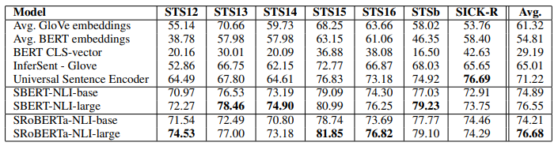

## Abstract

BERT（Devlin等人，2018）和RoBERTa（Liu等人，2019）在语义文本相似性（STS）等句对回归任务上创造了新的最先进性能。然而，它需要将两个句子都送入网络，这造成了大量的计算开销：在10,000个句子的集合中找到最相似的一对，需要用BERT进行大约5千万次推理计算（约65小时）。BERT的构造使得它不适合于语义相似性搜索以及像聚类这样的无监督任务。

在这份出版物中，我们提出了Sentence-BERT（SBERT），这是对预训练的BERT网络的修改，使用连体和三连体网络结构来得出有语义的句子嵌入，可以使用余弦相似度进行比较。这将寻找最相似对的努力从BERT/RoBERTa的65小时减少到SBERT的约5秒，同时保持BERT的准确性。

我们在常见的STS任务和转移学习任务上对SBERT和SRoBERTa进行了评估，它的表现超过了其他最先进的句子嵌入方法。

## 1 Introduction

在本出版物中，我们提出了Sentence-BERT（SBERT），这是一种使用连体和三连体网络对BERT网络的修改，能够得出有语义的句子嵌入。这使得BERT能够用于某些新的任务，而这些任务到现在为止还不适用于BERT。这些任务包括大规模的语义相似性比较、聚类和通过语义搜索进行信息检索。

BERT在各种句子分类和句对回归任务上创造了新的最先进的性能。BERT使用一个交叉编码器：两个句子被传递给变换器网络，并预测目标值。然而，由于可能的组合太多，这种设置不适合于各种对回归任务。在n = 10 000个句子的集合中找到相似度最高的一对，需要用BERT进行n-(n-1)/2 = 49 995 000次推理计算。 在现代V100 GPU上，这需要大约65小时。类似地，在Quora的4000多万个现有问题中找到与一个新问题最相似的问题，可以用BERT建模为一对一的比较，然而，回答一个查询需要50多个小时。

> 微調BERT進行文本相似度任務: $\text{[CLS][S1][SEP][S2][SEP]}$，須將句子對輸入以預測相似度。如果你要用此方法從大量文本中找尋和您給定文本最相似的一個，那你需要將每一筆文本與您給定的文本預測每一筆文本和給定文本的相似度，會很久。

解决聚类和语义搜索的常见方法是将每个句子映射到一个矢量空间，使语义相似的句子接近。研究人员已经开始将单个句子输入BERT，并得出固定大小的句子嵌入。**最常用的方法是对BERT输出层进行平均化（称为BERT嵌入）或通过使用第一个标记（[CLS]标记）的输出**。正如我们将表明的那样，**这种常见的做法产生的句子嵌入相当糟糕，往往比平均GloVe嵌入更糟糕（Pennington等人，2014）。**

为了缓解这一问题，我们开发了SBERT。连体网络结构使输入句子的固定大小向量可以被导出。使用像余弦相似性或曼哈顿/欧几里得距离这样的相似性措施，可以找到语义上相似的句子。这些相似度测量可以在现代硬件上极其有效地进行，使SBERT可以用于语义相似度搜索以及聚类。在10,000个句子的集合中寻找最相似的句子对的复杂性从使用BERT的65小时减少到计算10,000个句子的嵌入（使用SBERT约5秒）和计算余弦相似度（约0.01秒）。通过使用优化的索引结构，寻找最相似的Quora问题可以从50小时减少到几毫秒（Johnson等人，2017）。

我们在NLI数据上对SBERT进行了微调，它创建的句子嵌入明显优于其他最先进的句子嵌入方法，如InferSent（Conneau等人，2017）和Universal Sentence Encoder（Cer等人，2018）。在七个语义文本相似性（STS）任务上，SBERT与InferSent相比实现了11.7分的改进，与Universal Sentence Encoder相比实现了5.5分。在句子嵌入的评估工具包SentEval（Conneau和Kiela，2018）上，我们分别实现了2.1和2.6分的改进。

SBERT可以适应特定的任务。它在一个具有挑战性的论据相似性数据集（Misra等人，2016年）和一个用于区分维基百科文章不同部分的句子的三联体数据集（Dor等人，2018年）上创造了新的最先进的性能。

本文结构如下：第3节介绍了SBERT，第4节在常见的STS任务和具有挑战性的Argument Facet Similarity（AFS）语料库（Misra等人，2016）上评估了SBERT。第5节在SentEval上评估了SBERT。在第6节，我们进行了一项消融研究，以测试SBERT的一些设计方面。在第7节，我们比较了SBERT句子嵌入的计算效率与其他最先进的句子嵌入方法的对比。

## 2 Related Work

我们首先介绍了BERT，然后，我们讨论了目前最先进的句子嵌入方法。

BERT（Devlin等人，2018）是一个预训练的变换器网络（Vaswani等人，2017），它为各种NLP任务设置了新的最先进的结果，包括问题回答、句子分类和句对回归。用于句对回归的BERT的输入由两个句子组成，由一个特殊的[SEP]标记分开。在12层（基础模型）或24层（大型模型）上应用多头关注，输出被传递给一个简单的回归函数，以得出最终的标签。使用这种设置，BERT在语义文本相似度（STS）基准上创造了新的最先进的性能（Cer等人，2017）。RoBERTa（Liu等人，2019）表明，BERT的性能可以通过对预训练过程的小调整来进一步提高。我们还测试了XLNet（Yang等人，2019），但它总体上导致的结果比BERT更差。

BERT网络结构的一个很大的缺点是没有计算独立的句子嵌入，这使得从BERT得出句子嵌入变得很困难。为了绕过这一限制，研究人员通过BERT传递单个句子，然后通过平均输出（类似于平均词嵌入）或使用特殊CLS标记的输出，得出一个固定大小的向量（例如：May等人（2019）；Zhang等人（2019）；Qiao等人（2019））。 这两个选项也是由流行的bert-as-a-service-repository3提供。据我们所知，到目前为止，还没有评估这些方法是否会导致有用的句子嵌入。

句子嵌入是一个研究得很好的领域，有几十种提议的方法。Skip-Thought（Kiros等人，2015）训练一个编码器-解码器架构来预测周围的句子。 InferSent（Conneau等人，2017）使用斯坦福自然语言推理数据集（Bowman等人，2015）和MultiGenre NLI数据集（Williams等人，2018）的标记数据来训练一个连体BiLSTM网络，对输出进行最大池化。Conneau等人的研究表明，InferSent一直优于SkipThought等无监督方法。Universal Sentence Encoder（Cer等人，2018）训练了一个转化器网络，并通过SNLI的训练增强了无监督学习。Hill等人（2016）表明，训练句子嵌入的任务对其质量有很大影响。之前的工作（Conneau等人，2017；Cer等人，2018）发现，SNLI数据集适合训练句子嵌入。Yang等人（2018）提出了一种使用连体DAN和连体变换器网络对Reddit的对话进行训练的方法，在STS基准数据集上取得了良好的效果。

Humeau等人（2019）解决了来自BERT的交叉编码器的运行时间开销，并提出了一种方法（poly-encoders）来计算m个语境向量和使用注意力的预计算的候选嵌入之间的得分。这个想法对于在更大的集合中寻找最高得分的句子是有效的。然而，多编码器有一个缺点，即分数函数不是对称的，而且对于像聚类这样的用例来说，计算开销太大，这需要$O(n^2)$的分数计算。

以前的神经句子嵌入方法是从随机初始化开始训练的。 在本出版物中，我们使用预先训练好的BERT和RoBERTa网络，只对其进行微调以产生有用的句子嵌入。这大大减少了所需的训练时间：SBERT可以在不到20分钟内完成调整，同时产生比同类句子嵌入方法更好的结果。

## 3 Model

SBERT在BERT/RoBERTa的输出上增加了一个池化操作，以得出一个固定大小的句子嵌入。我们试验了三种池化策略：使用CLS-token的输出，计算所有输出向量的平均值（MEANstrategy），以及计算输出向量的最大超时（MAX-strategy）。默认配置是MEAN。

为了微调BERT / RoBERTa，我们创建了连体和三连体网络（Schroff等人，2015），以更新权重，使产生的句子嵌入具有语义，可以用余弦相似度进行比较。

网络结构取决于可用的训练数据。我们试验了以下结构和目标函数。

图1：具有分类目标函数的SBERT结构，例如，用于SNLI数据集的微调。 两个BERT网络具有并列的权重（连体网络结构）。

**分类目标函数。** 我们将句子嵌入$u$和$v$的元素之差$|u-v|$连接起来，并与可训练权重$W_t∈R^{3n×k}$相乘：

$$o = \text{softmax}(W_t(u, v, |u − v|))$$

其中n是句子嵌入的维度，k是标签的数量。我们优化交叉熵损失。这个结构在图1中被描述出来。

图2：推理时的SBERT架构，例如，计算相似性分数。这个架构也用于回归的目标函数。

**回归目标函数。** 两个句子嵌入$u$和$v$之间的余弦相似度被计算出来（图2）。我们使用均方误差损失作为目标函数。

**三重目标函数。** 给定一个锚点句子$a$，一个正面句子$p$和一个负面句子$n$，triplet loss调整网络，使$a$和$p$之间的距离小于$a$和$n$之间的距离：

$$max(||s_a − s_p|| − ||s_a − s_n|| + \epsilon, 0)$$

$s_x$是$a/n/p$的句子嵌入，$|| \cdot ||$是距离度量和余量$\epsilon$。余量$\epsilon$确保$s_p$至少比$s_n$更接近$s_a$。作为度量，我们使用欧氏距离，在我们的实验中，我们设定$\epsilon =1$。

### 3.1 Training Details

我们在SNLI（Bowman等人，2015）和Multi-Genre NLI（Williams等人，2018）数据集的组合上训练SBERT。SNLI是一个由57万个句子对组成的集合，注释了矛盾、缩略语和中性标签。MultiNLI包含430,000个句子对，涵盖了一系列的口语和书面文本的体裁。我们用3个软分类器的目标函数对SBERT进行了微调。我们使用了16个批次，学习率为2e-5的Adam优化器，以及10%的训练数据的线性学习率预热。我们默认的池化策略是MEAN。

## 4 Evaluation - Semantic Textual Similarity

我们评估了SBERT在常见的语义文本相似性（STS）任务中的表现。 最先进的方法通常学习一个（复杂的）回归函数，将句子嵌入映射到相似性分数。相反，我们总是使用余弦相似度来比较两个句子嵌入之间的相似度。我们还用负曼哈顿和负欧几里得距离作为相似度测量方法进行了实验，但所有方法的结果都大致相同。

表1：在各种文本相似性（STS）任务中，句子表征的余弦相似性和黄金标签之间的Spearman等级相关$ρ$。性能按惯例报告为$ρ×100$。STS12-STS16: SemEval 2012-2016, STSb：STSbenchmark, SICK-R: SICK relatedness dataset.

### 4.1 Unsupervised STS

我们在不使用任何STS特定训练数据的情况下评估了SBERT在STS中的表现。我们使用2012-2016年的STS任务（Agirre等人，2012，2013，2014，2015，2016），STS基准（Cer等人，2017），以及SICK-Relatedness数据集（Marelli等人，2014）。这些数据集在句子对的语义相关度上提供了0到5的标签。我们在（Reimers等人，2016）中表明，皮尔逊相关度很不适合STS。相反，我们计算了句子嵌入的余弦相似度和黄金标签之间的Spearman等级相关。其他句子嵌入方法的设置是等同的，相似度是通过余弦相似度计算的。结果见表1

结果显示，直接使用BERT的输出会导致相当差的性能。对BERT嵌入的平均数只达到了54.81的平均相关度，而使用CLStoken输出只达到了29.19的平均相关度。两者都比计算GloVe的平均嵌入要差。

使用所描述的连体网络结构和微调机制大大改善了相关性，大大超过了InferSent和Universal Sentence Encoder的表现。SBERT表现比Universal Sentence Encoder差的唯一数据集是SICK-R。Universal Sentence Encoder是在各种数据集上训练的，包括新闻、问答页和讨论区，这似乎更适合SICK-R的数据。相比之下，SBERT只在维基百科（通过BERT）和NLI数据上进行了预训练。

虽然RoBERTa能够提高几个监督任务的性能，但我们只观察到SBERT和SRoBERTa在生成句子嵌入方面的微小差异。

表2：对STS基准测试集的评估。 BERT系统用10个随机种子和4个epochs训练。SBERT在STSb数据集上进行了微调，SBERT-NLI在NLI数据集上进行了预训练，然后在STSb数据集上进行了微调。

### 4.2 Supervised STS

STS基准（STSb）（Cer等人，2017）提供是一个流行的数据集，用于评估有监督的STS系统。该数据包括来自标题、新闻和论坛三个类别的8,628个句子对。它被分为训练（5,749）、设计（1,500）和测试（1,379）。BERT在这个数据集上创造了新的最先进的性能，它将两个句子都传给了网络，并对输出使用了简单的回归方法。

我们使用训练集，利用回归目标函数对SBERT进行微调。在预测时，我们计算句子嵌入之间的余弦相似度。所有系统都是用10个随机种子进行训练，以对抗变异（Reimers和Gurevych，2018）。

结果在表2中描述。我们对两种设置进行了实验：只在STSb上训练，以及先在NLI上训练，然后在STSb上训练。我们观察到，后来的策略导致了1-2分的轻微改善。这种两步法对BERT交叉编码器的影响特别大，它的性能提高了3-4个点。我们没有观察到BERT和RoBERTa之间的显著差异

表3：Argument Facet Similarity（AFS）语料库的平均皮尔逊相关性r和平均斯皮尔曼等级相关性ρ（Misra等人，2016）。Misra等人提议进行10倍交叉验证。我们还在一个跨主题的情况下进行评估：方法在两个主题上训练，并在第三个主题上进行评估。

### 4.3 Argument Facet Similarity

我们在Misra等人（2016）的Argument Facet Similarity（AFS）语料库上评估SBERT。AFS语料库注释了来自社交媒体对话的6,000个句子论据对，涉及三个有争议的话题：枪支管制、同性恋婚姻和死刑。这些数据被注释为从0（"不同的话题"）到5（"完全等同"）的等级。AFS语料库中的相似性概念与SemEval的STS数据集中的相似性概念相当不同。STS数据通常是描述性的，而AFS数据是对话中的争论性摘录。要被认为是相似的，论据不仅要提出相似的主张，而且要提供相似的推理。此外，AFS中的句子之间的词汇差距要大得多。因此，简单的无监督方法以及最先进的STS系统在这个数据集上表现很差（Reimers等人，2019）。

我们在两种情况下对该数据集的SBERT进行评估：1）正如Misra等人所建议的，我们使用10倍交叉验证来评估SBERT。这种评估设置的一个缺点是，不清楚方法对不同主题的概括性如何。因此，2）我们在一个跨主题的设置中评估SBERT。两个主题用于训练，方法在被遗漏的主题上被评估。我们对所有三个主题重复这一过程，并对结果进行平均。

SBERT使用回归目标函数进行微调。相似性得分是使用基于句子嵌入的余弦相似性来计算的。我们还提供了皮尔逊相关r，以使结果与Misra等人的结果相媲美。然而，我们表明（Reimers等人，2016），皮尔逊相关有一些严重的缺点，应该避免用于比较STS系统。结果在表3中描述。

像tf-idf、平均GloVe嵌入或InferSent这样的无监督方法在这个数据集上表现得相当糟糕，得分很低。在10倍交叉验证设置中训练SBERT，其性能几乎与BERT相当。

然而，在跨主题的评估中，我们观察到SBERT的性能下降了大约7点Spearman相关性。要被认为是相似的，论据应该针对相同的主张，并提供相同的推理。BERT能够使用注意力来直接比较两个句子（例如逐字比较），而SBERT必须将单个句子从一个未见过的主题映射到一个向量空间，从而使具有类似主张和理由的论点接近。这是一个更具挑战性的任务，它似乎需要超过两个主题的训练，才能与BERT的工作相提并论。

表4：对维基百科部分三联体数据集的评估（Dor等人，2018）。用三联体损失训练的SBERT为一个 epoch

### 4.4 Wikipedia Sections Distinction

Dor等人（2018年）使用维基百科为句子嵌入方法创建了一个主题上细化的训练、设计和测试集。维基百科的文章被分成不同的部分，专注于某些方面。Dor等人认为，同一章节的句子在主题上比不同章节的句子更接近。他们利用这一点创建了一个大型的弱标记句子三联体数据集：锚和正面例子来自同一章节，而负面例子来自同一文章的不同章节。例如，来自Alice Arnold的文章：锚点：阿诺德在1988年加入了BBC广播剧团，正面：阿诺德在2012年5月获得了媒体的关注。，负面的：鲍丁和阿诺德都是热衷于业余高尔夫的人。

我们使用Dor等人的数据集。我们使用三联体目标，在大约180万个训练三联体上训练SBERT一个历时，并在222,957个测试三联体上评估它。测试三联体来自维基百科的一个独特的文章集。作为评估指标，我们使用准确性：正面例子是否比负面例子更接近锚点？

结果见表4。Dor等人微调了一个具有三倍损失的BiLSTM架构，以得出该数据集的句子嵌入。如表所示，SBERT明显优于Dor等人的BiLSTM方法。

## 5 Evaluation - SentEval

SentEval（Conneau和Kiela，2018）是一个流行的工具包，用于评估句子嵌入的质量。句子嵌入被用作逻辑回归分类器的特征。逻辑回归分类器在10倍交叉验证设置中对各种任务进行训练，并对测试倍数的预测准确性进行计算。

SBERT句子嵌入的目的不是为了用于其他任务的转移学习。在这里，我们认为Devlin等人（2018）为新任务描述的微调BERT是更合适的方法，因为它更新了BERT网络的所有层。然而，SentEval仍然可以对我们的句子嵌入在各种任务中的质量给出印象。

我们在以下七个SentEval转移任务上将SBERT的句子嵌入与其他句子嵌入方法进行比较：

* MR：对电影评论片段的情绪预测，以五级为起点（Pang and Lee, 2005）。
* CR：顾客产品评论的情绪预测（Hu and Liu, 2004）。
* SUBJ：对电影评论和情节摘要中的句子进行主观性预测（Pang and Lee, 2004）。
* MPQA：来自新闻网的短语级意见极性分类（Wiebe等人，2005）。
* SST：具有二进制标签的斯坦福情感树库（Socher等人，2013）。
* TREC：来自TREC的细粒度问题类型分类（Li and Roth, 2002）。
* MRPC：来自平行新闻源的微软研究院转述语料库（Dolan等人，2004）。

表5：使用SentEval工具包对SBERT句子嵌入的评估。SentEval通过训练一个以句子嵌入为特征的逻辑回归分类器，在不同的句子分类任务中评估句子嵌入。分数是基于10倍的交叉验证。

结果可以在表5中找到。SBERT能够在7个任务中的5个任务中取得最佳性能。与InferSent以及Universal Sentence Encoder相比，平均性能提高了约2个百分点。 尽管转移学习不是SBERT的目的，但它在这项任务上超过了其他最先进的句子嵌入方法。

看来，SBERT的句子嵌入很好地捕捉了情感信息：与InferSent和Universal Sentence Encoder相比，我们观察到SentEval对所有情感任务（MR、CR和SST）都有很大的改进。

SBERT明显比Universal Sentence Encoder差的唯一数据集是TREC数据集。通用句子编码器在问题回答数据上进行了预训练，这对于TREC数据集的问题类型分类任务似乎是有益的。

平均BERT嵌入或使用BERT网络的CLStoken输出在各种STS任务中取得了不好的结果（表1），比平均GloVe嵌入更差。然而，对于SentEval，平均BERT嵌入和BERT CLS-token输出取得了不错的结果（表5），超过了平均GloVe嵌入。 其原因是不同的设置。对于STS任务，我们使用余弦相似度来估计句子嵌入之间的相似性。余弦相似度对所有维度都是平等的。相比之下，SentEval将逻辑回归分类器用于句子嵌入。这使得某些维度对分类结果的影响有高有低。

我们的结论是，BERT的平均嵌入/CLS-token输出返回的句子嵌入不可能与余弦相似性或曼哈顿/欧氏距离一起使用。 对于转移学习，它们产生的结果比InferSent或通用句子编码器略差。然而，在NLI数据集上使用所描述的具有连体网络结构的微调设置，产生的句子嵌入达到了SentEval工具箱的新的先进水平。

## 6 Ablation Study

我们已经为SBERT句子嵌入的质量证明了强有力的经验结果。在本节中，我们对SBERT的不同方面进行了消减研究，以便更好地了解其相对重要性。

我们评估了不同的集合策略（MEAN、MAX和CLS）。对于分类目标函数，我们评估了不同的连接方法。对于每个可能的配置，我们用10个不同的随机种子训练SBERT，并对其性能进行平均。

目标函数（分类与回归）取决于注释的数据集。对于分类目标函数，我们在SNLI和Multi-NLI数据集上训练SBERTbase。对于回归目标函数，我们在STS基准数据集的训练集上进行训练。性能是在STS基准数据集的开发部分测量的。结果显示在表6中。

表6：用分类目标函数在NLI数据上训练的SBERT，用回归目标函数在STS基准（STSb）上训练的SBERT。配置是在STSb的开发集上使用余弦相似度和Spearman等级相关度进行评估的。对于串联方法，我们只报告使用MEAN集合策略的得分。

当用NLI数据的分类目标函数进行训练时，集合策略的影响相当小。串联模式的影响则大得多。InferSent（Conneau 3989等人，2017）和Universal Sentence Encoder（Cer等人，2018）都使用$(u, v, |u - v|, u ∗ v)$作为softmax分类器的输入。然而，在我们的架构中，添加e element-wise的$u ∗ v$降低了性能。

最重要的部分是element-wise difference$|u - v|$。请注意，连接模式只与训练softmax分类器有关。在推理中，当预测STS基准数据集的相似性时，只使用句子嵌入$u$和$v$与余弦相似性相结合。element-wise difference衡量两个句子嵌入的维度之间的距离，确保相似的对更接近，不相似的对相距更远。

当用回归目标函数进行训练时，我们发现集合策略有很大的影响。在这里，MAX策略的表现明显比MEAN或CLS-token策略差。这与（Conneau等人，2017）相反，他们发现InferSent的BiLSTM层使用MAX而不是MEAN池有好处。

## 7 Computational Efficiency

句子嵌入有可能需要对数百万个句子进行计算，因此，需要高计算速度。在本节中，我们将SBERT与GloVe平均嵌入、InferSent（Conneau等人，2017）和Universal Sentence Encoder（Cer等人，2018）进行比较。

对于我们的比较，我们使用STS基准的句子（Cer等人，2017）。我们使用一个简单的for-loop与python字典查询和NumPy计算平均GloVe嵌入。InferSent4是基于PyTorch的。对于Universal Sentence Encoder，我们使用TensorFlow Hub版本5，它是基于TensorFlow的。SBERT是基于PyTorch的。为了改进句子嵌入的计算，我们实施了一个智能批处理策略：这极大地减少了填充标记的计算开销。

性能是在一台配备英特尔i7-5820K CPU @ 3.30GHz、Nvidia Tesla V100 GPU、CUDA 9.2和cuDNN的服务器上测量的。结果见表7。

表7：句子嵌入方法的计算速度（每秒钟的句子）。越高越好。

在CPU上，InferSent比SBERT快约65%。这是由于网络结构要简单得多。InferSent使用一个BiLSTM层，而BERT使用12个堆叠的变压器层。然而，变压器网络的一个优势是在GPU上的计算效率。在那里，带有智能批处理的SBERT比InferSent快约9%，比Universal Sentence Encoder快约55%。智能批处理在CPU上实现了89%的提速，在GPU上实现了48%的提速。平均GloVe嵌入显然在很大程度上是计算句子嵌入的最快方法。

## 8 Conclusion

我们表明，BERT开箱即用，将句子映射到一个向量空间，而这个向量空间相当不适合与余弦相似性等常见的相似性措施一起使用。七个STS任务的性能低于GloVe平均嵌入的性能。

为了克服这个缺点，我们提出了句子ERT（SBERT）。SBERT在一个连体/三连体网络结构中对BERT进行了微调。我们在各种常见的基准上评估了其质量，在那里它可以实现比最先进的句子嵌入方法的重大改进。在我们的实验中，用RoBERTa代替BERT并没有产生明显的改善。

SBERT在计算上是高效的。在GPU上，它比InferSent快约9%，比Universal Sentence Encoder快约55%。SBERT可用于在计算上不可行的任务，用BERT建模。例如，用分层聚类法对10,000个句子进行聚类，用BERT需要大约65个小时，因为必须计算大约5000万个句子组合。使用SBERT，我们能够将这一努力减少到5秒左右。
