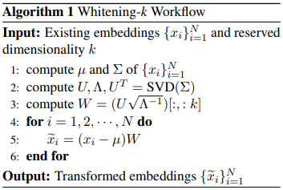
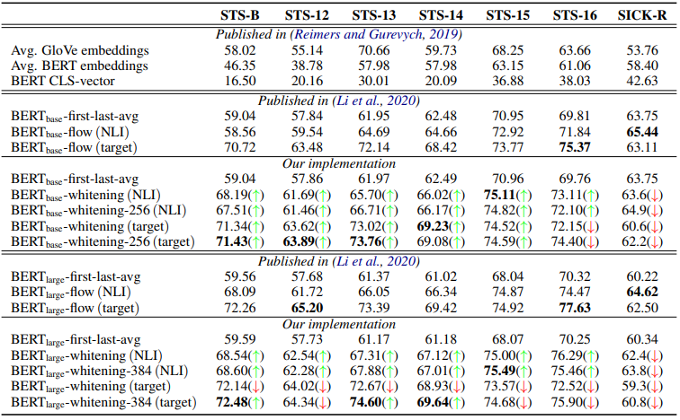
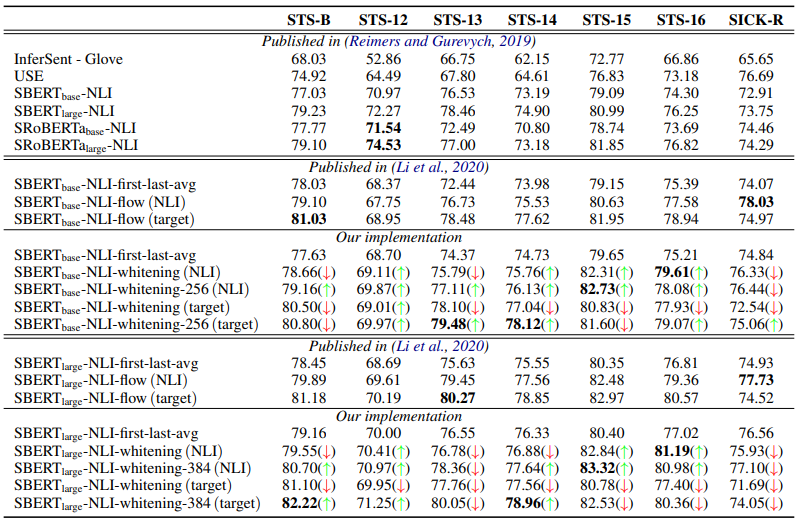
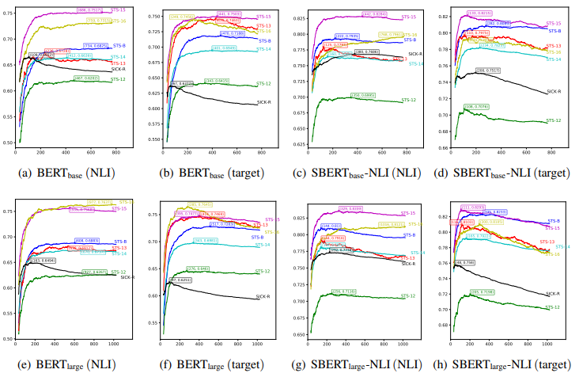

## Abstract

BERT 等預訓練模型在許多自然語言處理任務中取得了巨大成功。然而，如何通過這些預訓練模型獲得更好的句表徵向量仍然值得探索。先前的工作表明，各向異性問題是基於 BERT 的句表徵的關鍵瓶頸，阻礙模型充分利用底層語義特徵。因此，一些增強句子分佈各向同性的嘗試，例如基於流的模型(BERT-flow)，已被應用於句表徵並取得了一些改進。在本文中，我們發現傳統機器學習中的白化(球化)變換同樣可以增強句表徵的各向同性並取得有競爭力的結果。此外，白化還能夠降低句子表示的維度。我們的實驗結果表明，它不僅可以實現良好的性能，而且可以顯著降低存儲成本並加快模型檢索速度。

## Introduction

深度神經語言模型的應用(BERT、GPT)近年來取得了巨大成功，因為它們創造了對隨前後文語境改變的詞彙表徵向量。這一趨勢也刺激了為長文本產生語義崁入(句崁入向量、段落崁入向量)的研究進展。然而句崁入已被證明不能完整捕捉句子的基本語義。據先前研究([Gao et al., 2019; ][1][Ethayarajh, 2019; ][2][Li et al., 2020][3])，所有的詞語的表徵向量都不是[各項同性][4]的：它們在方向上並非均勻分布的，而是在崁入空間中佔據一個狹小的錐體，呈現各向異性。[Ethayarajh, 2019; ][2]證明，取自預訓練模型的崁入向量的極度的各向異性，以致任兩個詞的崁入向量COS相似度平均為0.99(極度相似)。[Li et al., 2020][3]進一步調查發現，BERT的句崁入空間存在兩問題:

1. 詞頻令崁入空間產生偏移：高頻詞距離原點較近，低頻詞距離原點較遠。在相同權重下，低頻詞對整體句崁入向量的遠比高頻詞影響更強
2. 低頻詞分散且稀疏：低頻詞在嵌入空間中與其他詞的最近距離(L2-dist)相較高頻詞更遠，使低頻的同義詞相似性更低

为了解决上述问题，([Ethayarajh, 2019;][2])阐述了导致各向异性问题的理论原因，在预训练模型中观察到。([Gao et al., 2019;][1])设计了一种新的方法，通过正则化单词嵌入矩阵来缓解退化问题。最近一个名为BERT-flow的尝试([Li et al., 2020][3])，提出通过归一化flow(Dinh等人，2014)将BERT句子嵌入分布转化为平滑和各向同性的高斯分布，这是一个由神经网络参数化的可逆函数。

在本文中，我们没有像以前的尝试那样设计一个复杂的方法，而是发现一个简单而有效的后处理技术--白化--足以解决句子嵌入的各向异性问题(Reimers and Gurevych, 2019)。具体来说，我们将句子向量的平均值转化为0，将协方差矩阵转化为單位矩陣。此外，我们还引入了降维策略，以促进白化操作，进一步提高我们方法的效果。

在7个标准语义文本相似性基准数据集上的实验结果表明，我们的方法能够普遍提高模型性能，并在大多数数据集上达到最先进的效果。同时，通过加入降维操作，我们的方法可以进一步提高模型性能，并自然地优化内存存储，加快检索速度。

本文的主要贡献总结如下：

* 我们探讨了基于BERT的句子嵌入在相似性匹配任务中表现不佳的原因，即它不处于标准的正交基础。
* 提出了一种白化后处理方法，将基于BERT的句子转化为标准的正交基础，同时减少其大小。
* 在七个语义文本相似性任务上的实验结果表明，我们的方法不仅可以显著提高模型性能，还可以减少向量大小。

## 2 Related Work

关于解决各向异性问题的早期尝试已经出现在特定的NLP背景下。(Arora等人，2017）首先计算了整个语义文本相似性数据集的句子表征，然后从这些句子表征中提取顶部方向，最后将句子表征投射到它之外。通过这样做，顶部方向将内在地编码整个数据集的共同信息。 (Mu and Viswanath, 2018)提出了一个后处理操作是在具有正负条目的密集低维表示上，他们从词向量中消除了共同的平均向量和几个顶部支配方向，这样就使现成的表示更加强大。([Gao et al., 2019;][1])提出了一种新颖的正则化方法来解决训练自然语言生成模型中的各向异性问题。他们设计了一种新颖的方法，通过对词嵌入矩阵的正则化来缓解退化问题。由于观察到词嵌入被限制在一个狭窄的锥体中，所提出的方法直接增加了锥体的孔径大小，这可以简单地通过减少单个词嵌入之间的相似度来实现。([Ethayarajh, 2019;][2])研究了上下文语境化词汇表征的内在机制。他们发现，ELMo、BERT和GPT-2的上层比下层产生更多的语境特异性表征。这种语境特异性的增加总是伴随着各向异性的增加。继([Ethayarajh, 2019;][2])的工作之后，（Li等人，2020）提出了BERT-flow，它通过归一化流将各向异性的句子嵌入分布转变为平滑和各向同性的高斯分布，这些都是用无监督的目标学习的。

谈到最先进的句子嵌入方法，以前的工作（Conneau等人，2017；Cer等人，2017）发现SNLI数据集适合训练句子嵌入，（Yang等人，2018）提出了一种使用连体DAN和连体变换器网络对Reddit的对话进行训练的方法，在STS基准数据集上取得了良好的结果。(Cer等人，2018）提出了一个所谓的通用句子编码器，它训练了一个变换器网络，并通过在SNLI数据集上的训练增强了无监督学习。在预训练方法的时代，（Humeau等，2019）解决了来自BERT的交叉编码器的运行时间开销，并提出了一种方法（poly-encoders），使用注意力计算上下文向量和预先计算的候选嵌入之间的分数。(Reimers and Gurevych, 2019）是对预训练的BERT网络的修改，使用连体和三连体网络结构来推导出有语义的句子嵌入，可以使用余弦相似度进行比较。

## 3 Our Approach

### 3.1 Hypothesis

句子嵌入应该能够直观地反映句子之间的语义相似性。 当我们检索语义相似的句子时，一般会将原始句子编码为句子表征，然后计算其角度的余弦值进行比较或排名（Rahutomo等人，2012）。因此，一个发人深省的问题出现了：余弦相似性对输入矢量做了什么假设？换句话说，什么前提条件适合用余弦相似性进行向量比较？

我们通过研究余弦相似性的几何学来回答这个问题。在几何学上，给定两个向量$x∈R^d$和$y∈R^d$，我们知道$x$和$y$的内积是欧几里得大小和它们之间角度的余弦的乘积。因此，余弦相似性$cos(x, y)$是$x$和$y$的内积除以其规范：

$$cos(x, y) = \frac{\sum^d_i x_i y_i }{\sqrt{\sum^d_i x^2_i} \sqrt{\sum^d_i y^2_i}} $$

然而，上述方程1只有在坐标基础为标准正交基础时才能满足。角度的余弦有明显的几何意义，但方程1是基于操作的，它取决于所选择的坐标基础。因此，内积的坐标公式随着坐标基础的变化而变化，余弦值的坐标公式也会相应变化。

（Li等人，2020）验证了来自BERT（Devlin等人，2019）的句子嵌入已经包含了足够的语义，尽管它没有被恰当地利用。在这种情况下，如果操作方程1来计算语义相似性的余弦值时，句子嵌入表现不佳，原因可能是句子向量所属的坐标基不是标准正交基。从统计学的角度来看，我们可以推断，当我们为一组向量选择基数时，应该保证每个基数向量都是独立和统一的。如果这组基是标准正交基，那么相应的一组向量就应该显示出各向同性。

综上所述，上述启发式假设阐述了：如果一组向量满足各向同性，我们可以认为它是由标准正交基数派生出来的，其中也表明我们可以通过方程1计算余弦相似度。否则，如果它是各向异性的，我们需要对原始句子嵌入进行转换，以强制其成为各向异性，然后使用方程1来计算余弦相似性。

### 3.2 Whitening Transformation

以前的工作（Li等人，2020）通过采用基于流量的方法来解决3.1节中的假设。我们发现，利用机器学习中普遍采用的白化操作，也可以取得相当的收益。

据我们所知，就标准正态分布而言，均值是$0$，协方差矩阵是一个單位矩陣。因此，我们的目标是将句子向量的平均值转化为$0$，将协方差矩阵转化为單位矩陣。假设我们有一组句子嵌入，也可以写成一组行向量$\{x_i\}^N_{i=1}$，然后我们进行方程2的线性变换，使$\{x_i\}^N_{i=1}$的平均值为0，协方差矩阵为同一矩阵：

$$\tilde{x_i} = (x_i − µ)W$$

上述公式2实际上对应于机器学习中的白化操作（Christiansen，2010）。为了让均值等于$0$，我们只需要启用：

$$µ = \frac{1}{N} \sum^N_{i=1} x_1$$

最困难的部分是解决矩阵W。为了实现这一点，我们将$\{x_i\}^N_{i=1}$的原始协方差矩阵表示为：

$$Σ = \frac{1}{N} \sum^N_{1=1} (x_i-\mu)^T (x_i-\mu)$$

然后我们可以得到转换后的协方差矩阵$\tilde{Σ}$：

$$\tilde{Σ} =W^T ΣW$$

由于我们规定新的协方差矩阵是一个單位矩陣，我们实际上需要解决下面的方程6：

$$W^T ΣW = I$$

因此

$$Σ = (W^T)^{−1} W^{−1}$$
$$= (W^{−1})^T W^{−1}$$

我们知道，协方差矩阵$Σ$是一个正定对称矩阵。正定对称矩阵满足以下形式的SVD分解（Golub and Reinsch, 1971）：

$$Σ = UΛU^T$$

其中$U$是一个正交矩阵，$Λ$是一个对角线矩阵，对角线元素都是正的。因此，让$W^{-1}=\sqrt{Λ}U^T$，我们可以得到解决方案：

$$W = U\sqrt{Λ^{−1}}$$

### 3.3 Dimensionality Reduction

到目前为止，我们已经知道，句子嵌入的原始协方差矩阵可以通过利用变换矩阵$W = U \sqrt{Λ^{-1}}$转换为一个單位矩陣。其中，正交矩阵U是一个保距变换，即不改变整个数据的相对分布，而是将原始协方差矩阵Σ转换为对角矩阵$Λ$。

据我们所知，对角线矩阵$Λ$的每个对角线元素衡量的是它所在的一维数据的变化。如果它的值很小，就代表这个维度特征的变化也很小，不明显，甚至接近于常数。因此，原始的句子向量可能只被嵌入到一个较低的维度空间中，我们可以在进行降维操作时去除这个维度特征，这样可以使余弦相似度的结果更加合理，并自然地加快向量检索的速度，因为它与维度成正比

事实上，从单值分解（Golub and Reinsch, 1971）得出的对角矩阵$Λ$中的元素已经按降序排列。因此，我们只需要保留$W$的前$k$列就可以达到这种降维效果，这在理论上等同于主成分分析（Abdi and Williams, 2010）。这里，$k$是一个经验性的超参数。我们将整个转换工作流程称为Whitening-k，其详细算法实现见算法1。

### 3.4 Complexity Analysis

就大规模语料库的计算效率而言，均值$μ$和协方差矩阵$Λ$可以递归计算。更具体地说，上述算法3.2需要的是整个句子向量$\{x_i\}^N_{i=1}$的均值向量$μ∈R^d$和协方差矩阵$Σ∈R^{d×d}$（其中$d$是词嵌入的维度）。因此，给定新的句子向量$x_{n+1}$，均值可以计算为：

$$µ_{n+1} = \frac{n}{n+1}µ_n + \frac{1}{n+1}x_{n+1}$$

同样，变异矩阵是$(x_i - µ)^T (x_i - µ)$的期望值，因此它可以计算为：

$$Σ_{n+1} = \frac{n}{n+1} Σ_n+\frac{1}{n+1} (x_{n+1} − µ)^T (x_{n+1} − µ)$$

因此，我们可以得出结论，$µ$和$Σ$的空间复杂度都是$O(1)$，时间复杂度是$O(N)$，这说明我们的算法效果已经达到理论上的最优。我们有理由推断，即使在大规模的语料库中，第3.2节中的算法也能在有限的内存存储中获得协方差矩阵$Σ$和$μ$。

## 4 Experiment

为了评估所提出的方法的有效性，我们提出了在多种配置下与语义文本相似性（STS）任务相关的各种任务的实验结果。在接下来的章节中，我们首先在第4.1节中介绍了基准数据集，在第4.2节中介绍了我们的详细实验设置。然后，我们在第4.3节中列出我们的实验结果和深入分析。此外，我们在第4.4节中评估了不同维度$k$设置下的降维效果。

### 4.1 Datasets

我们像（Reimers and Gurevych, 2019）那样，在没有任何特定训练数据的情况下，将模型性能与STS任务的基线进行比较。包括STS 2012-2016任务（Agirre等人，2012，2013，2014，2015，2016）、STS基准（Cer等人，2017）和SICK-Relatedness数据集（Marelli等人，2014）在内的7个数据集被作为我们的评估基准。对于每个句子对，这些数据集提供了一个标准的语义相似度测量，范围从0到5。我们采用句子嵌入的余弦相似度和黄金标签之间的Spearman等级相关，因为（Reimers和Gurevych，2019）认为它是STS任务中最合理的指标。评估程序与（Li et al., 2020）相同，我们首先将每个原始句子文本编码为句子嵌入，然后计算输入句子嵌入对之间的余弦相似度作为我们预测的相似度分数。

### 4.2 Experimental Settings and Baselines

**基线。** 我们将其性能与以下基线进行比较。在无监督的STS中，Avg.GloVe嵌入表示我们采用GloVe（Pennington等人，2014）作为句子嵌入。同样地，Avg.BERT嵌入和BERT CLS-vector表示我们使用原始BERT（Devlin等人，2019），并使用和不使用CLS-令牌输出。在超越监督的STS中，USE表示通用句子编码器（Cer等人，2018），它用转化器取代了LSTM。而SBERT-NLI和SRoBERTa-NLI对应于用Sentence-BERT训练方法（Reimers和Gurevych，2019）在组合NNLI数据集（构成SNLI（Bowman等人，2015）和MNLI（Williams等人，2018））上训练的BERT和RoBERTa（刘等人，2019）模型。

**实验细节。** 由于BERTflow(NLI/target)是我们要比较的主要基线，所以我们基本上与他们的实验设置和符号保持一致。具体来说，我们在实验中也同时使用BERTbase和BERTlarge。我们选择-first-last-avg2作为我们的默认配置，因为与只对最后一层进行平均计算相比，对BERT的第一层和最后一层进行平均计算可以稳定地实现更好的性能。 与（Li et al., 2020）类似，我们利用完整的目标数据集（包括训练集、开发集和测试集中的所有句子，但不包括所有标签），通过第3.2节所述的无监督方法计算美白参数$W$和$μ$。这些模型被符号化为-whitening(target)。此外，-whitening(NLI)表示白化参数是在NLI语料库中获得的。-whitening-256(target/NLI)和-whitening-384(target/NLI)表示通过我们的美白方法，输出的嵌入大小分别减少到256和384。

表1：没有NLI监督的结果。我们报告了句子嵌入的余弦相似度和多个数据集上的黄金标签之间的Spearman等级相关分数，即$ρ×100$。$↑$表示优于其BERT-flow基线的性能，$↓$表示性能不足。

表2：对NLI进行监督的结果。我们报告了句子嵌入的余弦相似度和多个数据集上的黄金标签之间的Spearman等级相关分数，即$ρ×100$。$↑$表示比其SBERT-flow基线表现更好，$↓$表示表现不佳。

### 4.3 Results

**没有NLI的监督。** 如表1所示，原始的BERT和GloVe句子嵌入在这些数据集上毫无悬念地获得了最差的性能。在BERTbase设置下，我们的方法一直优于BERT-flow，并分别在STS-B、STS12、STS-13、STS-14、STS-15数据集上取得了256句子嵌入维度的最先进的结果。当我们切换到BERTlarge时，如果将句子嵌入的维度设置为384，就会取得更好的结果。与BERT-flow相比，我们的方法在大多数数据集上仍然获得了有竞争力的结果，并在STS-B、STS-13、STS-14数据集上取得了最先进的结果，大约提高了1分。

**有了NLI的监督。** 在表2中，SBERTbase和SBERTlarge通过（Reimers和Gurevych，2019）中的方法在有监督标签的NLI数据集上进行训练。可以看出，我们的SBERTbase-whitening在STS13、STS-14、STS-15、STS-16任务上优于BERTbase-flow，SBERTlarge-whitening在STS-B、STS-14、STS-15、STS-16任务上取得了更好的结果BERTlarge-flow。这些实验结果表明，我们的白化方法可以进一步提高SBERT的性能，尽管它是在NLI数据集的监督下训练的。

图1：不同维度$k$与BERT-whitening对上述各项任务的影响。$X$轴是句子嵌入的保留维度，$Y$轴是Spearman的相关系数。每个子图上的标记点是最佳结果的位置。

### 4.4 Effect of Dimensionality $k$

降维是一个重要的特征，因为矢量大小的减少会带来更小的内存占用，并为下游矢量搜索引擎带来更快的检索。维数$k$是句子嵌入的保留维度的一个超参数，它能以较大的幅度影响模型的性能。因此，我们进行了实验，测试模型的Spearman相关系数随维度$k$的变化而变化。图1是BERTbase和BERTlarge嵌入下模型性能的变化曲线。对于大多数任务来说，将句子向量的维度降低到三分之一是一个相对最优的解决方案，其性能处于增长点的边缘。

在表1的SICK-R结果中，尽管我们的BERTbase-whitening-256（NLI）不如BERTbase-flow（NLI）有效，但我们的模型具有竞争优势，即嵌入尺寸较小（256对768）。此外，如图1（a）所示，当嵌入尺寸设置为109时，我们的BERTbase-whitening（NLI）的相关得分提高到了66.52，比BERTbase-flow（NLI）高出了1.08分。此外，其他任务也可以通过谨慎选择$k$来实现更好的性能。

## 5 Conclusion

在这项工作中，我们探索了一种替代方法来缓解句子嵌入的各向异性问题。我们的方法是基于机器学习中的白化操作，实验结果表明我们的方法在$7$个语义相似性基准数据集上是简单而有效的。此外，我们还发现，引入降维操作可以进一步提高模型的性能，并自然地优化内存存储和加快检索速度。

[1]: https://openreview.net/forum?id=SkEYojRqtm "Representation Degeneration Problem in Training Natural Language Generation Models 表徵退化"
[2]: https://aclanthology.org/D19-1006/ "How Contextual are Contextualized Word Representations? Comparing the Geometry of BERT, ELMo, and GPT-2 Embeddings 崁入向量的幾何結構"
[3]: https://aclanthology.org/2020.emnlp-main.733/ "On the Sentence Embeddings from Pre-trained Language Models BERT-flow"
[4]: https://en.wikipedia.org/wiki/Isotropic_position "各項同性 wiki(英文)"
