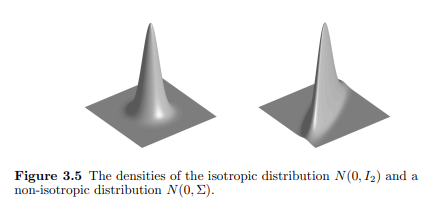
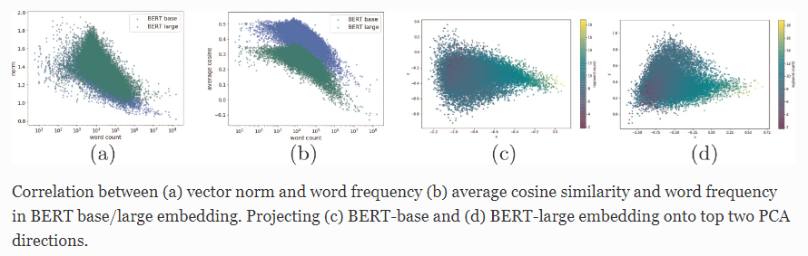

<!-- 因為上次一次報太多篇然後又沒有做好安排所以有些混亂，所以這次把所有相關論文看到的資訊整理成簡報進行報告。 -->

## 簡介

本次報告的內容如上，首先會報告直接在語意相似度任務中使用預訓練語言模型產生的上下文嵌入相較傳統靜態詞嵌入(GloVe)效果更差的奇怪現象，接著說明現有文獻對上下文嵌入和靜態詞嵌入的分布情況的可視化與探索以尋找嵌入空間之缺陷，然後簡易說明各項異性與各項同性分布的性質與影響，再來會報告現有文獻將上下文嵌入和靜態詞嵌入的分布轉換至各項同性對效能產生之影響，最後我將總結現有文獻資料和我自身之理解解釋該影響之成因。

## 問題發現:BERT << GloVe

於2019年，論文Sentence-BERT: Sentence Embeddings using Siamese BERT-Networks發現了直接使用BERT產生的sentenseEmbedding在語意相似度任務中表相當糟糕。具體表現如上圖，圖中使用斯皮爾曼等級相關係數對所有方法評鑑，其透過衡量各方法給出之語意相似度與測試資料及給出之相似度是否呈現單調相關，越大越好。圖中可以看見，當前聚焦的兩個方法分別為使用BERT的[CLS]token output當作sentenseEmbedding和對bert的outputLayer取平均作為sentenseEmbedding，我們可以看見這兩個方法的效能極差，甚至不如傳統的GloVe嵌入。這是非常奇怪的，照理來說，使用Transformer的bert嵌入在理論上比傳統的GloVe嵌入富含更多的語義資訊，甚至可以借其還原成完整的原始句子，應該會取得更好的效果才是。

## 靜態詞嵌入/語境化詞嵌入的分布情況

為進一步理解如BERT、GPT這些上下文模型產生的上下文嵌入，多篇研究於對上下文嵌入之分布的探索與研究被發表，上圖為論文Representation Degeneration Problem in Training Natural Language Generation Models中對三種不同模型嵌入分布的視覺化，我們可以看見Word2Vec與Classification模型的嵌入在原點周圍呈現多樣化的分布，代表不同的詞具有不同的語義含義，相較之下Transformer的嵌入分布退化到一個狹窄的錐體中，且不同token之間的餘弦相似度都是正的，表明不同token的嵌入都聚集在一起，并没有在嵌入空间中很好地分开。

## 各向異性/各向同性?

前一章節中我們提到Transformer的嵌入分布退化到一個狹窄的錐體中，而此種分布被命名為各向異性分布，反之若嵌入均勻分散在原點周圍則被稱為各向同性，如上圖。而各向異性分部有甚麼缺點呢? 我們將一組向量a, b, c映射到左右兩空間，

## 改善嵌入分布至各向同性是否成功改善效能

那我們已經知道各項異性分布會使餘弦相似度計算失準，那將各項異性分布映射回各向同性是否會提升效能呢，答案是肯定的。

使用黃底標註的方法對嵌入分布進行修正，將其應設為各向同性，

## 如何從理論解釋各向同性比各向異性優秀

那要如何進一步解釋將各向異性分布映射到各向同性為何會產生這麼大的性能變化呢?閱讀現有研究後我得到以下結論:

### 1. 餘弦相似度的假設

餘弦相似度的計算方法如上圖，我們可以看見其計算過程只使用兩向量的座標，並不考慮其所在空間之幾何特性，基底不同會影響資料的分布也會影響向量的座標，不考慮基底直接計算餘弦相似度可能會得到不好的效果。

### 2. 去相關

從前述資料我們已經知道，Transformer的嵌入分布退化到一個狹窄的錐體中，也就是所有token的嵌入之間都有一定程度的相似性，

<!-- ## 為什摸要各項同性?

先前研究表明，在傳統靜態嵌入中，所有的詞嵌入共享一個公共向量(bais)並擁有多個主導方向(各向異性)，而BERT嵌入也擁有相同的問題，這意味著平均餘弦相似度值顯著高於零，並且詞向量在向量空間中的窄錐體中聚集。這種現象會導致單詞表示與不相關的單詞具有很高的相似度，影響表達能力。

表中觀察到兩個現象

## 評鑑方法: Spearman's rank correlation coefficient

兩個變量排名之間的相關性，正值代表兩變量排序相同，負值代表兩變量排序相反，0代表兩變量排序沒有明顯關係。 -->
