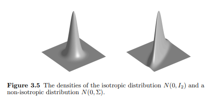
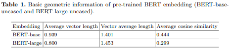
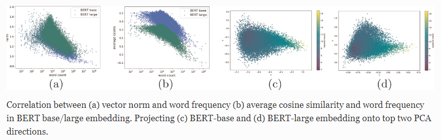

# 上下文嵌入以各項同性分布對於餘弦相似度計算之優勢

## 為什摸要各項同性?

先前研究表明，在傳統靜態嵌入中，所有的詞嵌入共享一個公共向量(bais)並擁有多個主導方向(各向異性)，而BERT嵌入也擁有相同的問題，這意味著平均餘弦相似度值顯著高於零，並且詞向量在向量空間中的窄錐體中聚集。這種現象會導致單詞表示與不相關的單詞具有很高的相似度，影響表達能力。

表中觀察到兩個現象

## 評鑑方法: Spearman's rank correlation coefficient

兩個變量排名之間的相關性，正值代表兩變量排序相同，負值代表兩變量排序相反，0代表兩變量排序沒有明顯關係。
